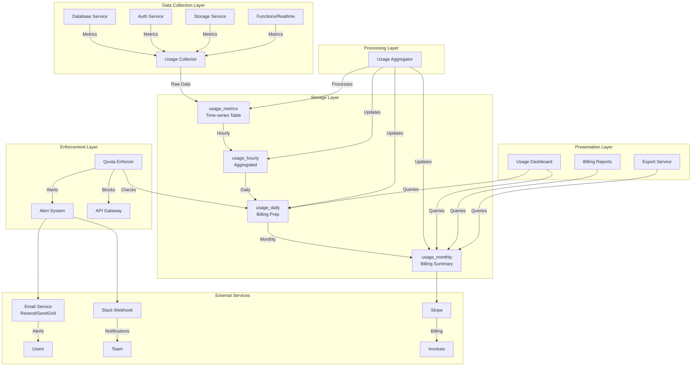
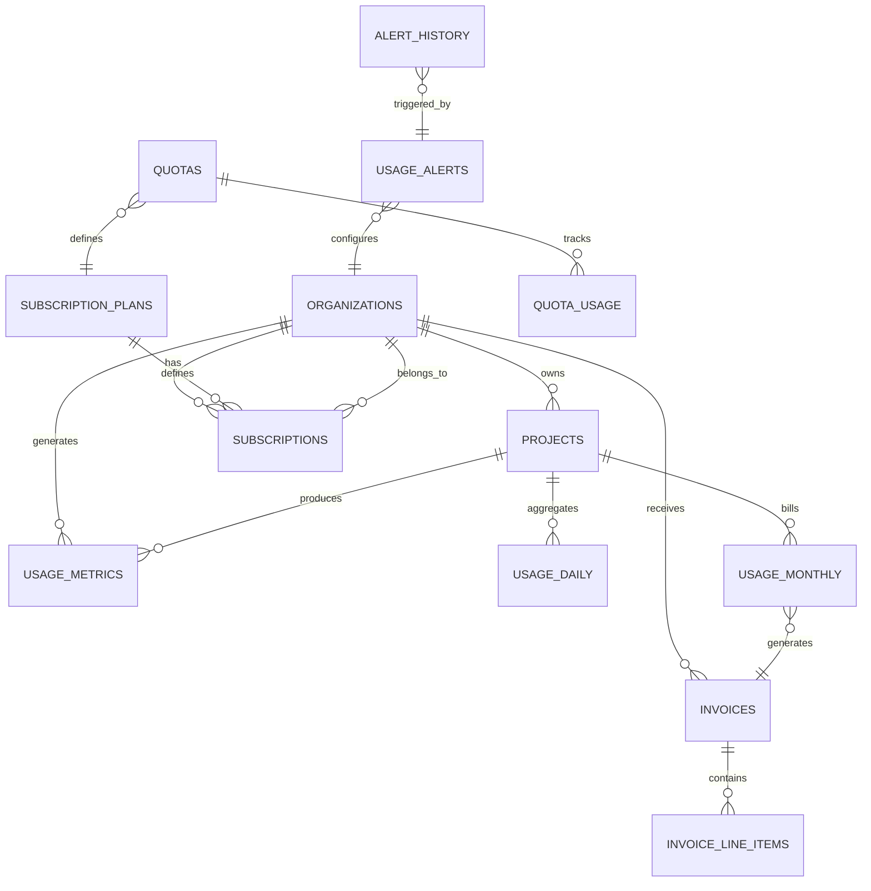

# Usage Tracking Architecture

This document provides a comprehensive overview of the usage tracking system architecture.

## 🏛️ System Architecture



## 📦 Component Breakdown

### 1. Data Collection Layer

**Purpose:** Collect raw usage metrics from all services

**Components:**
- **Edge Function:** `usage-collector/index.ts`
- **Collectors:**
  - `DatabaseUsageCollector` - DB size, connections, API requests
  - `AuthUsageCollector` - Users, MAUs, sign-ins, MFA
  - `StorageUsageCollector` - Storage size, objects, egress
  - `FunctionsUsageCollector` - Invocations, compute time
  - `RealtimeUsageCollector` - Connections, messages

**Collection Frequency:** Every 1 minute

**Data Flow:**
```
Services → Collector → Raw Metrics → usage_metrics table
```

---

### 2. Storage Layer

**Purpose:** Store and aggregate usage data at different granularities

**Tables:**

#### `usage_metrics` (Raw Time-series)
```sql
CREATE TABLE usage_metrics (
  id UUID,
  project_id UUID,
  metric_type TEXT,
  metric_name TEXT,
  metric_value DECIMAL,
  unit TEXT,
  timestamp TIMESTAMPTZ,
  metadata JSONB
)
-- Partitioned by timestamp (monthly)
```

**Retention:** 90 days

#### `usage_hourly` (Hourly Aggregates)
```sql
CREATE TABLE usage_hourly (
  hour_start TIMESTAMPTZ,
  metric_value DECIMAL,
  sample_count INTEGER,
  min_value DECIMAL,
  max_value DECIMAL,
  avg_value DECIMAL
)
```

**Retention:** 1 year

#### `usage_daily` (Daily Aggregates)
```sql
CREATE TABLE usage_daily (
  day DATE,
  metric_value DECIMAL,
  peak_value DECIMAL,
  sample_count INTEGER
)
```

**Retention:** Indefinite (billing history)

#### `usage_monthly` (Billing Summaries)
```sql
CREATE TABLE usage_monthly (
  month DATE,
  total_value DECIMAL,
  included_in_plan DECIMAL,
  billable_value DECIMAL,
  overage_cost DECIMAL
)
```

**Retention:** Indefinite

---

### 3. Processing Layer

**Purpose:** Aggregate raw data into billing-ready metrics

**Component:** `usage-aggregator/index.ts`

**Aggregation Strategy:**

```
Every Hour (at :05):
  - Read: usage_metrics (last hour)
  - Calculate: SUM, AVG, MIN, MAX
  - Write: usage_hourly

Every Day (at 01:00 UTC):
  - Read: usage_hourly (last 24 hours)
  - Calculate: Daily totals, peaks
  - Write: usage_daily

Every Month (on 1st at 02:00 UTC):
  - Read: usage_daily (current month)
  - Apply: Quotas, overage rates
  - Calculate: Billing costs
  - Write: usage_monthly
```

**Aggregation Rules:**

| Metric Type | Aggregation Method |
|-------------|-------------------|
| Size metrics (bytes) | MAX (peak usage) |
| Count metrics (requests) | SUM (total count) |
| Connection metrics | MAX (peak concurrent) |
| Duration metrics | SUM (total time) |

---

### 4. Enforcement Layer

**Purpose:** Monitor and enforce quota limits

**Component:** `quota-enforcer/index.ts`

**Enforcement Modes:**

#### Soft Enforcement
```
Usage > Quota
  ↓
Send Warning Alert
  ↓
Allow Continued Usage
  ↓
Charge Overage Fees
```

#### Hard Enforcement
```
Usage > Quota
  ↓
Block Service (HTTP 429)
  ↓
Send Critical Alert
  ↓
Require Manual Intervention
```

**Alert Channels:**
- Email (via Resend/SendGrid/AWS SES)
- Slack Webhook
- Custom Webhook
- In-app notifications

---

### 5. Presentation Layer

**Purpose:** Visualize usage data for customers and admins

**Components:**
- `UsageDashboard.tsx` - React component
- `/api/platform/usage/analytics.ts` - API endpoint

**Features:**
- Real-time usage visualization
- Quota utilization gauges
- Cost breakdown charts
- Historical trends
- Export functionality (CSV/JSON)

**Dashboard Views:**

```
┌─────────────────────────────────────┐
│  Usage & Billing Dashboard          │
├─────────────────────────────────────┤
│  [Summary Cards]                    │
│  - Total Cost  - Over Quota         │
│  - API Requests - DB Size           │
├─────────────────────────────────────┤
│  [Charts]                           │
│  ┌───────────┐ ┌─────────────────┐  │
│  │Trend Line │ │Cost Breakdown   │  │
│  └───────────┘ └─────────────────┘  │
├─────────────────────────────────────┤
│  [Tabs by Service]                  │
│  Database │ Auth │ Storage │ etc.   │
└─────────────────────────────────────┘
```

---

## 🔐 Security Architecture

### Row Level Security (RLS)

All tables implement RLS policies:

```sql
-- Organizations can only see their own data
CREATE POLICY org_isolation ON usage_metrics
FOR SELECT USING (
  organization_id IN (
    SELECT organization_id 
    FROM organization_members 
    WHERE user_id = auth.uid()
  )
);

-- Service role has full access
CREATE POLICY service_access ON usage_metrics
FOR ALL USING (
  auth.jwt()->>'role' = 'service_role'
);
```

### Data Isolation

```
Organization A → Can only see Org A data
Organization B → Can only see Org B data
Service Role   → Can see all data
```

---

## 📈 Scaling Strategy

### Horizontal Scaling

```
┌──────────────┐
│ Load Balancer│
└──────┬───────┘
       │
   ┌───┴───┐
   ▼       ▼
┌─────┐ ┌─────┐
│Func │ │Func │  ← Multiple instances
│  A  │ │  B  │
└──┬──┘ └──┬──┘
   │       │
   ▼       ▼
┌────────────┐
│   Database │
│ (Partitioned)
└────────────┘
```

### Database Partitioning

```sql
-- Monthly partitions for usage_metrics
CREATE TABLE usage_metrics_2024_01 
PARTITION OF usage_metrics
FOR VALUES FROM ('2024-01-01') TO ('2024-02-01');

CREATE TABLE usage_metrics_2024_02 
PARTITION OF usage_metrics
FOR VALUES FROM ('2024-02-01') TO ('2024-03-01');
```

**Benefits:**
- Faster queries (partition pruning)
- Easy archival/deletion
- Improved maintenance

### Indexing Strategy

```sql
-- Core indexes
CREATE INDEX idx_usage_metrics_project_timestamp 
ON usage_metrics(project_id, timestamp DESC);

CREATE INDEX idx_usage_metrics_organization_timestamp 
ON usage_metrics(organization_id, timestamp DESC);

CREATE INDEX idx_usage_daily_project_day 
ON usage_daily(project_id, day DESC);
```

---

## 🔄 Data Flow Examples

### Example 1: API Request Tracked

```
1. User makes API request
   POST /rest/v1/users
   
2. Kong Gateway logs request
   {project_ref, timestamp, method, path}
   
3. Usage Collector reads logs (every minute)
   SELECT count(*) FROM api_logs 
   WHERE timestamp > last_collection
   
4. Stores in usage_metrics
   INSERT INTO usage_metrics 
   (metric_type: 'database', metric_name: 'api_requests', value: 150)
   
5. Hourly Aggregator processes (at :05)
   SELECT SUM(metric_value) 
   FROM usage_metrics 
   WHERE hour = current_hour
   
6. Updates usage_hourly
   UPSERT INTO usage_hourly 
   SET metric_value = 9000  -- 150 * 60 minutes
```

### Example 2: Quota Exceeded Alert

```
1. Usage reaches 85% of quota
   database_size: 8.5GB / 10GB limit
   
2. Quota Enforcer checks (every 5 min)
   SELECT current_usage FROM quota_usage
   WHERE percentage_used > 80
   
3. Finds violation
   percentage_used = 85%
   enforcement = 'soft'
   
4. Triggers alert
   - Send email to customer
   - Log to alert_history
   - Update dashboard notification
   
5. Customer sees alert in dashboard
   ⚠️ You've used 85% of your database quota
   [Upgrade Plan] button
```

### Example 3: Monthly Billing

```
1. Month ends (April 30, 23:59 UTC)

2. Monthly Aggregator runs (May 1, 02:00 UTC)
   SELECT SUM(metric_value) 
   FROM usage_daily 
   WHERE month = '2024-05'
   
3. Calculates overages
   Total DB Size: 12GB
   Included: 10GB
   Billable: 2GB
   Rate: $0.000000125/GB
   Overage Cost: $262.14
   
4. Creates invoice line items
   INSERT INTO invoice_line_items
   (description: 'Database storage overage',
    quantity: 2GB,
    unit_price: 0.000000125,
    amount: 262.14)
   
5. Generates invoice
   Subtotal: $287.14 ($25 base + $262.14 overage)
   Tax: $28.71 (10%)
   Total: $315.85
   
6. Sends to Stripe
   stripe.invoices.create({...})
```

---

## 💾 Database Schema Relationships



---

## 🎯 Key Design Decisions

### Why Multi-tier Aggregation?

**Problem:** Raw time-series data is too large for efficient querying

**Solution:** Three-tier aggregation
```
Raw (1M points/hour) → Hourly (1K points/day) → Daily (30 points/month) → Monthly (1 point/month)
```

**Benefits:**
- Fast queries (query pre-aggregated data)
- Reduced storage (99% compression)
- Historical analysis possible
- Billing calculations simplified

### Why Use DECIMAL Instead of FLOAT?

**Reason:** Financial precision

```sql
-- Correct for billing
DECIMAL(20, 6) -- 14 digits before decimal, 6 after

-- Avoids floating-point errors
0.1 + 0.2 = 0.3 ✓ (with DECIMAL)
0.1 + 0.2 = 0.30000000000000004 ✗ (with FLOAT)
```

### Why Partition Tables?

**Reason:** Performance and maintainability

**Without partitioning:**
```sql
-- Query scans entire table (slow)
SELECT * FROM usage_metrics 
WHERE timestamp > '2024-01-01'
-- Scans: 100M rows
```

**With partitioning:**
```sql
-- Query only scans relevant partition (fast)
SELECT * FROM usage_metrics 
WHERE timestamp > '2024-01-01'
-- Scans: 1M rows (99% faster)
```

### Why Edge Functions?

**Reasons:**
1. **Low latency** - Runs close to users
2. **Auto-scaling** - Handles traffic spikes
3. **Cost-effective** - Pay per execution
4. **Easy deployment** - Single command

---

## 🔧 Configuration Options

### Collection Intervals

```toml
# Recommended defaults
collection_interval = "1m"      # Collect raw metrics
hourly_aggregation = "5 * * * *" # Run at :05 past each hour
daily_aggregation = "0 1 * * *"  # Run at 1 AM UTC
monthly_aggregation = "0 2 1 * *" # Run at 2 AM UTC on 1st
quota_check = "*/5 * * * *"      # Check every 5 minutes
```

### Retention Periods

```toml
raw_metrics_retention = "90d"
hourly_aggregates_retention = "1y"
daily_aggregates_retention = "indefinite"
monthly_summaries_retention = "indefinite"
```

### Alert Thresholds

```toml
warning_threshold = 80    # Alert at 80% usage
critical_threshold = 100  # Block at 100% (hard enforcement)
alert_cooldown = "1h"     # Don't spam alerts
```

---

## 📊 Performance Benchmarks

### Expected Scale (Single Project)

| Metric | Volume |
|--------|--------|
| Raw metrics/hour | ~1M rows |
| Hourly aggregates/day | 24 rows |
| Daily aggregates/month | 30 rows |
| Monthly summaries/year | 12 rows |

### Query Performance

```sql
-- Raw data query (with index)
SELECT * FROM usage_metrics 
WHERE project_id = 'xxx' 
AND timestamp > NOW() - INTERVAL '1 hour'
-- Execution time: ~50ms

-- Daily aggregate query
SELECT * FROM usage_daily 
WHERE project_id = 'xxx' 
AND day > NOW() - INTERVAL '30 days'
-- Execution time: ~5ms

-- Monthly billing query
SELECT SUM(overage_cost) FROM usage_monthly
WHERE month = CURRENT_DATE
-- Execution time: ~2ms
```

---

## 🛡️ Disaster Recovery

### Backup Strategy

```sql
-- Daily automated backups (Supabase managed)
-- Point-in-time recovery (last 7 days)

-- Manual backup script
pg_dump -h db.xxx.supabase.co \
  -U postgres \
  --table='usage_*' \
  -F c \
  backup.dump
```

### Data Quality Checks

```sql
-- Verify aggregation completeness
SELECT 
  COUNT(DISTINCT day) as days_with_data,
  EXTRACT(DAY FROM (MAX(day) - MIN(day))) as expected_days
FROM usage_daily;
-- Should be equal

-- Check for missing hours
SELECT generate_series(
  NOW() - INTERVAL '24 hours',
  NOW(),
  INTERVAL '1 hour'
) AS expected_hour
EXCEPT
SELECT hour_start FROM usage_hourly;
-- Should return 0 rows
```

---

## 📈 Future Enhancements

### Planned Features

1. **Predictive Analytics**
   - Forecast usage trends
   - Predict quota breaches
   - Recommend plan upgrades

2. **Anomaly Detection**
   - Identify unusual usage patterns
   - Detect potential abuse
   - Auto-scale warnings

3. **Multi-currency Support**
   - Display costs in local currency
   - Handle exchange rates
   - Regional pricing tiers

4. **Custom Metrics**
   - User-defined metric tracking
   - Custom aggregation logic
   - Flexible billing rules

---

## 📝 Glossary

| Term | Definition |
|------|------------|
| **MAU** | Monthly Active Users |
| **Overage** | Usage exceeding plan quota |
| **Soft Limit** | Warning-only quota enforcement |
| **Hard Limit** | Blocking quota enforcement |
| **Time-series** | Data points indexed by timestamp |
| **Partition** | Database table split for performance |
| **Aggregation** | Combining multiple data points into summary |

---

## 🔗 Related Documentation

- [Deployment Guide](./deploy-usage-tracking.ps1)
- [Quick Start](./QUICK_START_USAGE_TRACKING.md)
- [API Reference](./USAGE_TRACKING_README.md#api-endpoints)
- [Troubleshooting](./USAGE_TRACKING_README.md#troubleshooting)
