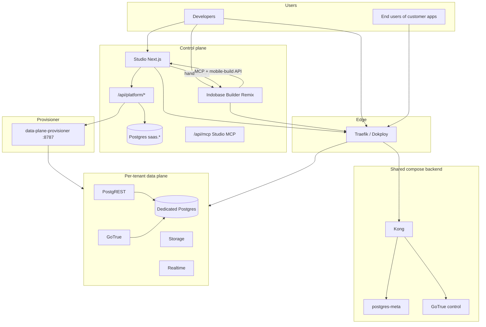
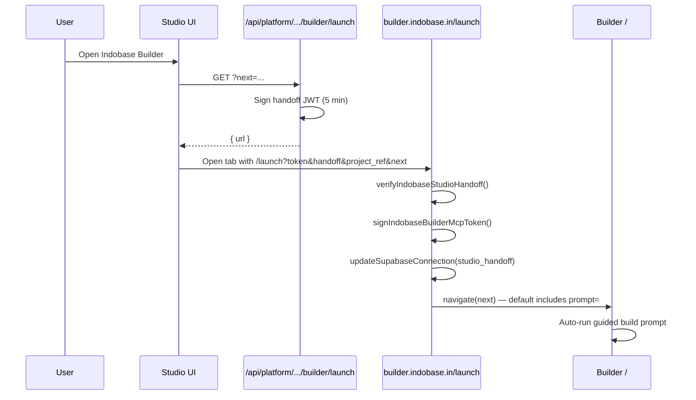

# Indobase — Engineering Platform Handbook

> **Audience:** Engineering, QA, product, and ops teams onboarding to Indobase.  
> **Repo:** [Indobase/Indobase](https://github.com/Indobase/Indobase) · **Branch:** `main`  
> **Companion:** [`docs/TEAM-HANDBOOK.md`](./TEAM-HANDBOOK.md) (design tokens, contributor conventions, glossary)  
> **Last updated:** June 2026

---

## Table of contents

1. [Executive summary](#1-executive-summary)
2. [System architecture](#2-system-architecture)
3. [Current features & production status](#3-current-features--production-status)
4. [Studio ↔ Builder integration](#4-studio--builder-integration)
5. [Screen inventory — Studio](#5-screen-inventory--studio)
6. [Screen inventory — Indobase Builder](#6-screen-inventory--indobase-builder)
7. [Screen inventory — Marketing & other apps](#7-screen-inventory--marketing--other-apps)
8. [API surface](#8-api-surface)
9. [UAT, E2E, and test coverage](#9-uat-e2e-and-test-coverage)
10. [CI/CD & production operations](#10-cicd--production-operations)
11. [Environment variables (engineering cheat sheet)](#11-environment-variables-engineering-cheat-sheet)
12. [Multitenancy, RLS, and data safety](#12-multitenancy-rls-and-data-safety)
13. [Known gaps & operational notes](#13-known-gaps--operational-notes)
14. [Related documentation index](#14-related-documentation-index)

---

## 1. Executive summary

**Indobase** is a managed Postgres BaaS with a **multi-tenant SaaS control plane** (organizations, billing, projects, provisioning) and a **Supabase-compatible data plane** per project (PostgREST, GoTrue, Realtime, Storage, Edge Functions).

| Surface | URL | Role |
|---------|-----|------|
| **Studio** | `https://studio.indobase.in` | Control-plane dashboard + `/api/platform/*` |
| **Control-plane API gateway** | `https://api.indobase.in` | Shared Kong → GoTrue / meta / analytics |
| **Per-tenant API** | `https://{project-ref}.indobase.in` | Dedicated data-plane stack per project |
| **Builder** | `https://builder.indobase.in` | AI app builder (Remix), launched from Studio |
| **Marketing** | `https://indobase.in` | Pricing, DPDP, contact (`apps/www`) |
| **Docs** | `https://indobase.in/docs` | Product docs (`apps/docs`) |

**Default SaaS flow:** Sign up → confirm email → sign in → create org → create project → **choose Builder or Backend** → connect app (Connect modal) → ship (hosting / mobile builds).

**Monorepo:** pnpm workspaces + Turborepo · Node ≥ 22 · primary apps under `apps/`, shared packages under `packages/`, data plane under `docker/`.

---

## 2. System architecture

### 2.1 High-level diagram



### 2.2 Control plane vs data plane

| Layer | Responsibility | Key code paths |
|-------|----------------|----------------|
| **Control plane** | Orgs, members, billing (Razorpay INR), project metadata, API keys, provisioning orchestration, mobile builds, deployments | `apps/studio/pages/api/platform/`, `apps/studio/lib/api/saas/` |
| **Control-plane DB** | `saas.*` schema with RLS | `supabase/migrations/`, `MULTITENANCY_RLS.md` |
| **Shared data-plane compose** | Kong, control Postgres, meta, analytics, **provisioner** | `docker/docker-compose.yml` |
| **Tenant stack** | Per-project PostgREST, GoTrue, Storage, Realtime, Functions | `docker/tenants/{ref}/`, provisioner |
| **Provisioner** | Write compose + Traefik YAML, `docker compose up` | `docker/provisioner/server.mjs` (VPS may run patched bind-mount) |

**Default:** New projects get a **dedicated tenant database** (`SAAS_DEDICATED_DATABASE_ON_PROJECT_CREATE`).

**Health gating:** Projects reach `ACTIVE_HEALTHY` when tenant REST + Auth are reachable, not only when provision scripts finish.

### 2.2.1 Request flow (Studio → tenant DB)

1. Browser authenticates via GoTrue; JWT in session cookie.
2. UI calls same-origin `/api/platform/...`.
3. `apiWrapper({ withAuth: true })` validates JWT → `claims`.
4. SaaS handlers query `saas.*` via postgres-meta (`STUDIO_PG_META_URL`).
5. Tenant schema operations resolve encrypted `connection_string` → pg-meta proxy `/api/platform/pg-meta/[ref]/*`.

### 2.3 Production topology (June 2026)

| Component | Deployment | Notes |
|-----------|------------|-------|
| **Studio** | Docker Swarm on VPS (`indobase-studio-erpgp1`) | Image `roshanraghavander/ind-repo:<git-sha>` |
| **Builder** | Docker Swarm on VPS | Image `roshanraghavander/indobase-builder:<sha>`, Traefik `builder.indobase.in` |
| **Compose backend** | Docker Compose on VPS | Kong, Postgres, meta, provisioner, Traefik attach |
| **Tenant stacks** | Per-project compose | Host paths + Traefik `tenant-{ref}.yml` |
| **Fleet repair** | Cron / scripts | `tenant-fleet-health-repair.sh`, `repair-tenant-stacks-on-vps.sh` |

Rollout runbook: `docker/DOKPLOY-STUDIO-DEPLOY.md`. Verify: `GET https://studio.indobase.in/api/health/live` → `version` equals git SHA.

---

## 3. Current features & production status

Legend: **Shipped** = in production path · **Partial** = UI/API exists, ops or parity gaps · **Planned** = stub or roadmap

### 3.1 Control plane (SaaS)

| Feature | Status | Notes |
|---------|--------|-------|
| Email/password auth + MFA | **Shipped** | GoTrue; `sign-in`, `sign-in-mfa` |
| Org + team management | **Shipped** | Invites, roles, audit |
| Project create + dedicated DB | **Shipped** | `provision-tenant-db.ts` |
| Per-tenant data-plane stack | **Shipped** | Provisioner + Traefik |
| Data-plane auto-repair | **Partial** | Studio calls `/repair-stack`; VPS provisioner must expose route |
| Razorpay billing (INR) | **Shipped** | Stripe UI disabled when Razorpay on |
| Usage metering | **Shipped** | Org/project usage APIs |
| DPDP data principal flows | **Shipped** | Export/requests in account privacy |
| Platform admin console | **Shipped** | Operator-gated `/platform-admin/*` |
| Plugin marketplace | **Partial** | Org + platform admin surfaces |
| AWS Marketplace onboarding | **Partial** | Dedicated route |
| GitHub / Vercel org integrations | **Partial** | OAuth + deploy button flows |

### 3.2 Project product (Studio)

| Feature | Status | Notes |
|---------|--------|-------|
| Project experience chooser (Builder vs Backend) | **Shipped** | `ProjectExperienceChooser` |
| Builder launch handoff | **Shipped** | Signed JWT + `next=` redirect |
| Connect modal (frameworks, ORMs, MCP, DB URI) | **Shipped** | `Connect.tsx` |
| Table editor | **Shipped** | pg-meta backed |
| SQL editor | **Shipped** | Saved queries, templates |
| Database browser (schemas, functions, triggers, …) | **Shipped** | Feature flags on some items |
| Auth admin (users, providers, SMTP, hooks) | **Shipped** | Tenant GoTrue config |
| Storage (files, vectors, analytics buckets) | **Shipped** | Tenant storage API |
| Edge Functions | **Shipped** | Per-tenant functions volume |
| Realtime inspector | **Shipped** | |
| Advisors (security / performance) | **Shipped** | Linter integration |
| Observability + service logs | **Shipped** | Unified logs behind flag |
| Branches / merge requests | **Partial** | Preview DB branching |
| Replication UI | **Partial** | Stubs + SaaS routes |
| Project hosting (Indobase subdomain) | **Shipped** | Settings + deployment executor |
| Custom domains | **Shipped** | Traefik dynamic config |
| Mobile builds (Android AAB) | **Shipped** | Queue from Studio + Builder |
| Infrastructure settings (provision/repair) | **Shipped** | Ops-facing |
| AI SQL assistant | **Partial** | Needs `OPENAI_API_KEY` |

### 3.3 Indobase Builder

| Feature | Status | Notes |
|---------|--------|-------|
| Studio handoff (`/launch`) | **Shipped** | JWT verify, MCP token, connection persist |
| AI chat + workbench | **Shipped** | WebContainer preview |
| Studio-linked backend (`studio_handoff`) | **Shipped** | Anon key + API URL auto-wired |
| Deploy menu → Studio hosting | **Shipped** | Opens Studio hosting URL |
| Queue Android build from Builder | **Shipped** | `api.indobase.mobile-build` → Studio |
| Auto MCP server for Indobase | **Shipped** | When handoff active |
| GitHub / GitLab / Vercel / Netlify deploy | **Shipped** | Third-party paths |
| OpenRouter default LLM | **Shipped** | Free Nemotron models in prod env |

### 3.4 Client SDKs

| Package | Status | Notes |
|---------|--------|-------|
| `@indobaseinc/indobase-js` | **Shipped** (npm) | Published scope |
| Workspace `indobase-js` shims | **Partial** | Studio Docker must declare deps for publish |
| Audit: zero Supabase in shipped bundle | **In progress** | `scripts/audit-no-supabase.sh` |

---

## 4. Studio ↔ Builder integration

### 4.1 One-shot launch flow



### 4.2 Key files

| Concern | Path |
|---------|------|
| Studio CTA | `apps/studio/components/interfaces/ProjectExperienceChooser/BuilderLaunchButton.tsx` |
| Launch API | `apps/studio/pages/api/platform/projects/[ref]/builder/launch.ts` |
| Handoff token + URL | `apps/studio/lib/api/saas/builder-launch.ts` |
| Builder `/launch` route | `indobase-builder/app/routes/launch.tsx` |
| Connection state | `indobase-builder/app/lib/stores/supabase.ts` |
| MCP auto-config | `indobase-builder/app/lib/indobase/mcp.ts` |
| Mobile build proxy | `indobase-builder/app/routes/api.indobase.mobile-build.ts` |
| Studio mobile-build API | `apps/studio/pages/api/platform/projects/[ref]/mobile-builds/builder.ts` |
| MCP auth (Studio) | `apps/studio/lib/api/saas/builder-mcp-auth.ts` |

### 4.3 Secrets (must match across Studio + Builder)

| Variable | Purpose |
|----------|---------|
| `BUILDER_HANDOFF_SECRET` | HS256 signing (≥ 32 chars) |
| `BUILDER_APP_URL` / `NEXT_PUBLIC_BUILDER_APP_URL` | Builder origin |
| `AUTH_JWT_SECRET` / `JWT_SECRET` | Fallback if handoff secret unset |

### 4.4 Default `next=` behavior

Studio passes a `next` path so Builder lands on `/` with a **prefilled `prompt=`** that:

1. Plans and starts building the web app for the linked project  
2. Surfaces publish-to-Indobase-hosting steps  
3. Surfaces Android bundle queue steps  

Builder strips unsafe `next` values (must be relative path, no `://`).

---

## 5. Screen inventory — Studio

Studio uses **Next.js Pages Router** (`apps/studio/pages/`). ~195 UI routes, ~220 API routes. Layouts in `components/layouts/`; features in `components/interfaces/`.

### 5.1 Authentication & onboarding

| Route | Screen | Primary UI / behavior |
|-------|--------|------------------------|
| `/sign-up` | Registration | Email, DPDP consent → `/api/platform/signup` |
| `/sign-in` | Login | Password → GoTrue |
| `/sign-in-mfa` | MFA challenge | TOTP |
| `/sign-in-sso` | SSO login | Org SSO |
| `/forgot-password` | Reset request | Email flow |
| `/reset-password` | New password | Token from email |
| `/auth/confirm` | Email confirm | GoTrue redirect |
| `/logout` | Sign out | Clears session |
| `/join` | Accept invite | Org membership |
| `/organizations` | Org picker | List orgs after login |
| `/new`, `/new/[slug]` | Create org | Plan selection, Razorpay |
| `/billing/plans` | Plan comparison | Public pricing context |

### 5.2 Organization (`/org/[slug]/…`)

| Route | Screen | Primary UI / behavior |
|-------|--------|------------------------|
| `/org/[slug]` | **Projects home** | Project list, create project |
| `/org/[slug]/team` | Team | Members, invites |
| `/org/[slug]/billing` | Billing | Subscription, Razorpay |
| `/org/[slug]/usage` | Usage | Org-level meters |
| `/org/[slug]/general` | Org settings | Name, slug |
| `/org/[slug]/security` | Security | MFA policy |
| `/org/[slug]/sso` | SSO config | IdP settings |
| `/org/[slug]/audit` | Audit log | Org events |
| `/org/[slug]/integrations` | Integrations | GitHub, Vercel |
| `/org/[slug]/plugins` | Plugins | Marketplace |
| `/org/[slug]/apps` | OAuth apps | Org OAuth clients |

### 5.3 Project shell

| Route | Screen | Primary UI / behavior |
|-------|--------|------------------------|
| `/project/[ref]` | **Experience chooser** | Builder vs Backend cards, `BuilderLaunchButton` |
| `/project/[ref]/backend` | Backend home | Database/auth/storage shortcuts |
| `/project/[ref]/building` | Provisioning wait | Redirect when stack healthy |
| **Connect (modal)** | Connect to project | Framework snippets, MCP tab, API keys, DB URI — not a standalone route |

### 5.4 Database & SQL

| Route | Screen | Primary UI / behavior |
|-------|--------|------------------------|
| `/project/[ref]/editor` | Table editor index | Grid editor |
| `/project/[ref]/editor/[id]` | Edit table | Columns, RLS link |
| `/project/[ref]/sql` | SQL editor | Run queries |
| `/project/[ref]/sql/[id]` | Saved query | |
| `/project/[ref]/database/schemas` | Schema visualizer | ERD-style |
| `/project/[ref]/database/tables` | Tables list | |
| `/project/[ref]/database/functions` | DB functions | |
| `/project/[ref]/database/triggers/*` | Triggers | |
| `/project/[ref]/database/migrations` | Migrations | SaaS migration API |
| `/project/[ref]/database/settings` | DB settings | |
| `/project/[ref]/database/backups/*` | Backups / PITR | |
| `/project/[ref]/branches` | Branches | Preview DBs |

### 5.5 Auth (tenant GoTrue admin)

| Route | Screen | Primary UI / behavior |
|-------|--------|------------------------|
| `/project/[ref]/auth/users` | Users | CRUD, ban, metadata |
| `/project/[ref]/auth/providers` | Providers | Google, email, phone |
| `/project/[ref]/auth/smtp` | SMTP | Mail settings |
| `/project/[ref]/auth/templates/*` | Email templates | |
| `/project/[ref]/auth/url-configuration` | Redirect URLs | Site URL, allow list |
| `/project/[ref]/auth/hooks` | Auth hooks | Beta |
| `/project/[ref]/auth/policies` | RLS policies | Links to DB policies |
| `/project/[ref]/auth/mfa`, `/sessions`, `/rate-limits` | Security tuning | |
| `/project/[ref]/auth/audit-logs` | Auth audit | |

### 5.6 Storage

| Route | Screen | Primary UI / behavior |
|-------|--------|------------------------|
| `/project/[ref]/storage/files` | Buckets | File browser |
| `/project/[ref]/storage/files/buckets/[id]` | Bucket detail | Objects, policies |
| `/project/[ref]/storage/vectors` | Vector buckets | |
| `/project/[ref]/storage/analytics` | Analytics buckets | |
| `/project/[ref]/storage/s3` | S3 compatibility | Connection info |

### 5.7 Edge Functions & Realtime

| Route | Screen | Primary UI / behavior |
|-------|--------|------------------------|
| `/project/[ref]/functions` | Functions list | Deploy, secrets |
| `/project/[ref]/functions/[slug]/code` | Code editor | Deno functions |
| `/project/[ref]/realtime/inspector` | Realtime inspector | Channel test |
| `/project/[ref]/realtime/policies` | Realtime policies | |

### 5.8 Logs & observability

| Route | Screen | Primary UI / behavior |
|-------|--------|------------------------|
| `/project/[ref]/logs` | Unified logs | Feature-flagged hub |
| `/project/[ref]/logs/explorer` | Log explorer | Saved queries |
| `/project/[ref]/logs/*-logs` | Service logs | Postgres, PostgREST, Auth, Storage, Edge, pooler |
| `/project/[ref]/observability/*` | Metrics dashboards | Per-service charts |
| `/project/[ref]/advisors/security` | Security advisor | Lint findings |

### 5.9 Integrations

| Route | Screen | Primary UI / behavior |
|-------|--------|------------------------|
| `/project/[ref]/integrations` | Marketplace | Cron, Queues, Webhooks, Data API docs, Vault, wrappers |
| `/project/[ref]/integrations/[id]/[pageId]` | Integration sub-pages | e.g. GraphiQL, cron jobs |

### 5.10 Project settings (ops-heavy)

| Route | Screen | Primary UI / behavior |
|-------|--------|------------------------|
| `/project/[ref]/settings/general` | General | **Hosting**, **mobile builds**, project name |
| `/project/[ref]/settings/infrastructure` | Infrastructure | Provision/repair data plane, activity log |
| `/project/[ref]/settings/api-keys` | API keys | Anon/service/publishable keys |
| `/project/[ref]/settings/jwt` | JWT secrets | Signing keys |
| `/project/[ref]/settings/api` | API / PostgREST | Config |
| `/project/[ref]/settings/compute-and-disk` | Compute | SaaS disk |
| `/project/[ref]/settings/log-drains` | Log drains | |
| `/project/[ref]/settings/billing/usage` | Project usage | |

### 5.11 Account & platform admin

| Route | Screen | Primary UI / behavior |
|-------|--------|------------------------|
| `/account/me` | Profile | |
| `/account/security` | Account security | MFA, password |
| `/account/privacy` | DPDP | Export, deletion requests |
| `/platform-admin` | Operator overview | Fleet health |
| `/platform-admin/projects` | All projects | |
| `/platform-admin/organizations` | All orgs | |
| `/platform-admin/health` | Fleet health | Tenant probes |

---

## 6. Screen inventory — Indobase Builder

Remix app: `indobase-builder/`. Primary routes under `app/routes/`.

### 6.1 User-facing screens

| Route | Screen | Primary UI / behavior |
|-------|--------|------------------------|
| `/` | **Main builder** | Header, AI chat, workbench (editor, preview, terminal) |
| `/launch` | Handoff loader | Verifies Studio JWT, links project, redirects to `next` |
| `/chat/[id]` | Chat session | Same as index, persisted chat id |
| `/git` | Git import | Import repo into workbench |

### 6.2 Builder chrome & panels

| Area | Path | Behavior |
|------|------|----------|
| Header | `components/header/Header.tsx` | Logo; “Backend linked” badge when `studio_handoff` |
| Deploy menu | `components/deploy/DeployButton.tsx` | Indobase hosting, custom domain, **Android AAB**, GitHub/GitLab, open Studio project |
| Supabase connection | `components/chat/SupabaseConnection.tsx` | Read-only when Studio-managed |
| Settings panel | `components/@settings/core/ControlPanel.tsx` | Profile, providers, MCP, Git hosts |
| Workbench | `components/workbench/` | File tree, Monaco, preview iframe, terminal |

### 6.3 Builder API routes (server)

| Route | Purpose |
|-------|---------|
| `api.chat.ts` | LLM streaming |
| `api.indobase.mobile-build.ts` | Proxy queue build → Studio |
| `api.mcp-*` | MCP tooling |
| `api.supabase*` | Legacy Supabase cloud helpers |
| `api.vercel-deploy.ts`, `api.netlify-deploy.ts` | External deploy |
| `api.health.ts` | Health |

---

## 7. Screen inventory — Marketing & other apps

| App | Path | Routes (sample) | Purpose |
|-----|------|-----------------|--------|
| **www** | `apps/www/` | `/`, `/pricing`, `/privacy`, `/terms`, `/dpdp`, `/contact-us` | Marketing, legal |
| **docs** | `apps/docs/` | `/docs/*` | Product documentation |
| **design-system** | `apps/design-system/` | `/docs/components/*` | Token + component gallery |
| **ui-library** | `apps/ui-library/` | Registry browser | shadcn-style blocks |

---

## 8. API surface

### 8.1 Studio control-plane API (`/api/platform/`)

Authenticated via GoTrue JWT unless noted. Implementation: `apps/studio/lib/api/saas/`.

| Domain | Example routes | Module |
|--------|----------------|--------|
| Auth profile | `profile`, `profile/data-export` | `platform.ts`, `data-principal.ts` |
| Organizations | `organizations/[slug]/members`, `billing`, `usage` | `org-billing.ts`, `razorpay-billing.ts` |
| Projects | `projects`, `projects/[ref]/api-keys` | `platform.ts`, `settings.ts` |
| **Builder** | `projects/[ref]/builder/launch` | `builder-launch.ts` |
| **Mobile builds** | `projects/[ref]/mobile-builds`, `mobile-builds/builder` | `mobile-builds.ts` |
| **Hosting / deploy** | `projects/[ref]/deployments`, `hosting` | `deployments.ts`, `hosting.ts` |
| Provisioning | `provision-data-plane`, `tenant-stack` | `tenant-data-plane-provision.ts` |
| pg-meta proxy | `pg-meta/[ref]/query`, `tables`, … | `project-connection.ts` |
| Auth admin | `auth/[ref]/users`, `config` | `gotrue-config.ts` |
| Storage proxy | `storage/[ref]/buckets` | Tenant storage |
| Billing webhook | `razorpay/webhook` | `razorpay-billing.ts` |
| Admin | `admin/*` | `platform-admin.ts` |
| MCP | `/api/mcp` | `builder-mcp-auth.ts` |

### 8.2 Compatibility API (`/api/v1/`)

Supabase Management API shape for branches, signing keys, functions, migrations — used by Studio data layer and external tooling.

### 8.3 Provisioner API (internal)

| Endpoint | Method | Purpose |
|----------|--------|---------|
| `/health` | GET | Liveness |
| `/provision` | POST | Write compose + Traefik, `docker compose up` |
| `/repair-stack` | POST | Re-apply one tenant stack |
| `/repair-fleet` | POST | Re-apply all tenant stacks |

Studio triggers provision via `POST /api/platform/projects/[ref]/provision-data-plane`.

### 8.4 Health endpoints

| URL | Expected |
|-----|----------|
| `https://studio.indobase.in/api/health/live` | `{ "status": "ok", "version": "<git-sha>" }` |
| `https://api.indobase.in/auth/v1/health` | GoTrue version JSON |
| `https://builder.indobase.in/api/health` | Builder health |

---

## 9. UAT, E2E, and test coverage

There is **no separate UAT document**; **Playwright E2E + Vitest** serve as acceptance layers.

### 9.1 Test pyramid

| Layer | Tool | Location | CI workflow |
|-------|------|----------|-------------|
| Unit / SaaS logic | Vitest | `apps/studio/lib/**/*.test.ts` (~145 files) | `studio-unit-tests.yml` |
| Component | Vitest + Testing Library | Colocated | `studio-unit-tests.yml` |
| Studio E2E | Playwright | `e2e/studio/features/*.spec.ts` (21 specs) | `studio-e2e-test.yml` |
| Builder unit | Vitest | `indobase-builder/app/**/*.spec.ts` | Builder `ci.yaml` |
| UI packages | Vitest | `packages/ui`, `ui-patterns` | `ui-tests.yml` |

### 9.2 E2E spec → screen mapping (UAT matrix)

| Playwright spec | Screens / flows covered | Notes |
|-----------------|-------------------------|-------|
| `home.spec.ts` | `/project/[ref]` home | Project landing |
| `connect.spec.ts` | Connect modal | Framework snippets, keys |
| `database.spec.ts` | Database section | Schema navigation |
| `table-editor.spec.ts` | Table editor | Grid CRUD |
| `sql-editor.spec.ts` | SQL editor | Run query |
| `auth-users.spec.ts` | Auth users | User list |
| `rls-policies.spec.ts` | RLS policies | Policy UI |
| `storage.spec.ts` | Storage buckets | |
| `logs.spec.ts` | Logs views | |
| `log-drains.spec.ts` | Log drains settings | |
| `realtime-inspector.spec.ts` | Realtime inspector | |
| `cron-jobs.spec.ts` | Cron integration | |
| `database-webhooks.spec.ts` | Webhooks integration | |
| `queue-table-operations.spec.ts` | Queues integration | |
| `infrastructure-settings.spec.ts` | Infrastructure settings | Provision UI |
| `api-access-toggle.spec.ts` | API access toggle | |
| `filter-bar.spec.ts` | Filter bar pattern | |
| `status-page-banner.spec.ts` | Incident banner | |
| `index-advisor.spec.ts` | Index advisor | |
| `assistant.spec.ts` | AI assistant | Needs `OPENAI_API_KEY` |
| `tenant-rest-health.spec.ts` | Live tenant REST | **Opt-in**; needs anon key |

### 9.3 Critical SaaS unit tests (integration-style)

| Test file | Covers |
|-----------|--------|
| `builder-launch.test.ts` | Handoff URL, backend config, JWT |
| `deployments.test.ts`, `deployments-executor.test.ts` | Hosting queue |
| `mobile-builds.test.ts`, `mobile-builds-executor.test.ts` | Android builds |
| `tenant-compose-validation.test.ts` | Compose safety |
| `tenant-data-plane-url.test.ts` | Public URLs |
| `project-health.test.ts` | Health gating |
| `indobase-builder/.../studioApi.spec.ts` | Builder mobile-build gating |

### 9.4 Running acceptance tests locally

```bash
# Studio unit
pnpm test:studio

# E2E (SaaS / local stack)
cp e2e/studio/.env.local.saas.example e2e/studio/.env.local
cd e2e/studio && pnpm exec playwright install
pnpm e2e

# E2E UI mode
pnpm e2e -- --ui
```

See `e2e/studio/README.md`, `.claude/skills/e2e-studio-tests/SKILL.md`.

### 9.5 UAT gaps (not covered by E2E today)

| Flow | Gap |
|------|-----|
| Studio → Builder handoff | No Playwright cross-origin spec |
| Builder Deploy → Studio hosting | Manual |
| Razorpay checkout | Manual / staging |
| Mobile build executor on VPS | Manual + unit tests |
| Per-tenant routing (`{ref}.indobase.in`) | Opt-in `tenant-rest-health` only |
| Platform admin console | No dedicated E2E |
| DPDP export/delete | No dedicated E2E |

---

## 10. CI/CD & production operations

### 10.1 Images (on push to `main`)

| Image | Tag pattern |
|-------|-------------|
| Studio | `roshanraghavander/ind-repo:<sha>` |
| Provisioner | `roshanraghavander/ind-repo-provisioner:<sha>` |
| Builder | `roshanraghavander/indobase-builder:<sha>` |

Workflow: `.github/workflows/docker-publish.yml`

### 10.2 Studio rollout (Swarm)

```bash
SHA=$(git rev-parse HEAD)
docker pull roshanraghavander/ind-repo:$SHA
docker service update --image roshanraghavander/ind-repo:$SHA <swarm_service>
/usr/local/bin/indobase-studio-attach-compose-network.sh
curl -sS https://studio.indobase.in/api/health/live  # version == SHA
```

### 10.3 Operational scripts (VPS)

| Script | Purpose |
|--------|---------|
| `indobase-studio-attach-compose-network.sh` | Studio ↔ compose network |
| `indobase-control-plane-disk-prune.sh` | Prune unused images when disk ≥80% (prevents Postgres ENOSPC → GoTrue “Database error querying schema”) |
| `indobase-traefik-attach-compose-network.sh` | Traefik ↔ compose backend |
| `tenant-fleet-health-repair.sh` | Fleet self-heal |
| `repair-tenant-stacks-on-vps.sh` | Password + routing repair |
| `cap-idle-tenant-stacks.sh` | Cap idle tenant stacks |
| `project-deployment-executor.sh` | Hosting deploy worker |
| `project-mobile-build-executor.sh` | Android build worker |
| `deploy-indobase-builder-on-vps.sh` | Builder Swarm deploy |

### 10.4 Runbooks

| Document | Topic |
|----------|-------|
| `docker/DOKPLOY-STUDIO-DEPLOY.md` | Studio deploy |
| `docker/DOKPLOY-STUDIO-ENV.md` | Studio secrets |
| `docker/DOKPLOY-DATA-PLANE.md` | Tenant provisioning |
| `docker/docs/TENANT_DATA_PLANE_TUNING.md` | Resource limits |
| `docker/docs/ADRAL-TENANT-RUNBOOK.md` | Example tenant ops |
| `PRODUCTION_READINESS.md` | Launch checklist |

---

## 11. Environment variables (engineering cheat sheet)

### 11.1 Client (rebuild required)

| Variable | Purpose |
|----------|---------|
| `NEXT_PUBLIC_INDOBASE_SAAS` | Enables SaaS (`IS_SAAS`) |
| `NEXT_PUBLIC_SITE_URL` | Studio origin |
| `NEXT_PUBLIC_SUPABASE_URL` | Browser API gateway |
| `NEXT_PUBLIC_GOTRUE_URL` | Auth client |
| `NEXT_PUBLIC_ANON_KEY` | Anon JWT in bundle |
| `NEXT_PUBLIC_BUILDER_APP_URL` | Builder launch target |
| `NEXT_PUBLIC_RAZORPAY_*` | INR billing UI |

### 11.2 Server — control plane

| Variable | Purpose |
|----------|---------|
| `POSTGRES_*` | Control-plane Postgres |
| `STUDIO_PG_META_URL` | postgres-meta |
| `PG_META_CRYPTO_KEY` | Connection encryption |
| `AUTH_JWT_SECRET` | JWT + handoff fallback |
| `DATA_PLANE_PROVISIONER_URL` | Provisioner base URL |
| `DATA_PLANE_PROVISIONER_TOKEN` | Provisioner auth |
| `BUILDER_HANDOFF_SECRET` | Studio ↔ Builder JWT |
| `RAZORPAY_*` | Billing |
| `PLATFORM_OPERATOR_*` | Admin access |

### 11.3 Server — data plane / tenants

| Variable | Purpose |
|----------|---------|
| `SAAS_PUBLIC_DOMAIN` | `{ref}.indobase.in` |
| `SAAS_DOCKER_NETWORK_NAME` | Tenant network |
| `SAAS_DATA_PLANE_AUX_ROLE_PASSWORD` | Shared aux DB role |
| `SAAS_DEDICATED_DATABASE_ON_PROJECT_CREATE` | Per-project DB |
| `SAAS_TENANT_*` | Pooler, SMTP, PostgREST limits |

Full lists: `apps/studio/.env.example`, `docker/.env.example`, `docker/DOKPLOY-STUDIO-ENV.md`, `WIRING.md`.

---

## 12. Multitenancy, RLS, and data safety

| Model | Doc | Use case |
|-------|-----|----------|
| Control-plane `saas.*` RLS | `MULTITENANCY_RLS.md` | Org/project membership isolation |
| Dedicated DB per project | `DATA_PLANE_MIGRATIONS.md` | Default tenant data plane |
| Shared-table RLS template | `templates/shared_table_rls/` | Customer app multi-tenancy |

**JWT tenant claim sync:** `syncStudioTenantClaim.ts` — keeps app JWT aligned with org/project.

**India DPDP:** Marketing + signup consent + account privacy APIs (`data-principal.ts`).

---

## 13. Known gaps & operational notes

| Area | Note |
|------|------|
| **Provisioner `/repair-stack`** | Studio expects repair endpoints; VPS image may need bind-mount patch until repo provisioner ships routes |
| **Docker Hub CI** | Verify SHA tags exist before Swarm rollout |
| **Builder ↔ Studio E2E** | No automated cross-app acceptance test yet |
| **Stripe** | Disabled when Razorpay billing enabled |
| **Replication** | UI largely stubbed |
| **Audit rebrand** | Ongoing — `docs/AUDIT_REBRAND.md` |
| **npm SDK in Docker** | Studio `package.json` must declare `@indobaseinc/*` for docker-publish |
| **AppleDouble `._*` files** | Break git/docker on macOS — keep out of repo |

---

## 14. Related documentation index

| Document | Use when |
|----------|----------|
| [`docs/TEAM-HANDBOOK.md`](./TEAM-HANDBOOK.md) | Design system, local dev, contributor norms |
| [`WIRING.md`](../WIRING.md) | URL/env contract |
| [`MULTITENANCY_RLS.md`](../MULTITENANCY_RLS.md) | RLS design |
| [`PRODUCTION_READINESS.md`](../PRODUCTION_READINESS.md) | Launch checklist |
| [`DEVELOPERS.md`](../DEVELOPERS.md) | Monorepo dev setup |
| [`AGENTS.md`](../AGENTS.md) | Agent/production facts |
| [`e2e/studio/README.md`](../e2e/studio/README.md) | E2E setup |
| [`docker/DOKPLOY-STUDIO-DEPLOY.md`](../docker/DOKPLOY-STUDIO-DEPLOY.md) | Production deploy |
| [`apps/studio/lib/api/saas/DATA_PLANE_MIGRATIONS.md`](../apps/studio/lib/api/saas/DATA_PLANE_MIGRATIONS.md) | Tenant DB bootstrap |

---

*This handbook is the platform engineering reference for Indobase as of June 2026. For token pipelines and design workflows, use `TEAM-HANDBOOK.md`. For line-level API details, follow into `apps/studio/lib/api/saas/` and `pages/api/platform/`.*
