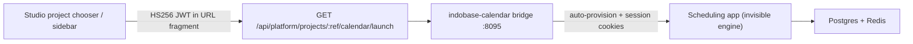

# Indobase Calendar — scheduling for org / project

Indobase Calendar (`indobase-calendar/`) is the first-class scheduling product for every organization and project. The engine is self-hosted scheduling (official `calcom/cal.diy` Docker image, MIT); customer-facing branding is **Calendar** / **Indobase Calendar** only — never name the engine in UI. See [INDOBASE-ECOSYSTEM-NAMING.md](./INDOBASE-ECOSYSTEM-NAMING.md).

| Host (prod) | Host (staging) |
|---|---|
| `calendar.indobase.in` | `calendar.indobase.fun` |

## Customer naming

| Use | Name |
|---|---|
| Product (chooser, launch, titles) | **Calendar** |
| Full product chrome | Indobase Calendar |
| Never in UI | Cal.com, cal.diy, Cal, Calendly, “Powered by …” |

Control plane: Vyom **103.190.92.249** (same pattern as Discuss / Meet / Workspace).

---

## Architecture (Phase 1)



| Layer | Role |
|---|---|
| **Studio** | Mints `aud=indobase-calendar` handoff JWT; org role gate (owner/admin/developer/viewer) |
| **Bridge** | `/sso/launch` fragment exchange, session cookie, auto-provision engine user, brand HTML proxy, `/events` `/team` `/settings` aliases |
| **Engine** | Official `calcom/cal.diy` image — not vendored; Traefik routes only to the bridge |

Studio session SSO only. Bridge redirects native engine auth/register/password/signup routes to Studio sign-in.

---

## Org / project → Calendar space mapping

| Indobase | Calendar | Stable key |
|---|---|---|
| Organization slug | Org / team grouping | `ib-cal-org-{sanitized_org_slug}` |
| Project ref | Public booking username | `ib-cal-{sanitized_project_ref}` |

Implementation (must stay in sync):

- `indobase-calendar/bridge/src/space-map.ts`
- `apps/studio/lib/api/saas/calendar-launch-shared.ts`
- Workspace mint: `indobase-suite/bridge/src/calendar.ts`

Deep link after SSO: `/events` (alias → engine event types).

### Role mapping

| Studio org role | Calendar role | Capabilities |
|---|---|---|
| owner | Owner | manage + edit |
| admin | Admin | manage + edit |
| developer | Member | edit |
| viewer | Readonly | view |

---

## SSO contract

Same shape as other ecosystem products (`product-handoff.ts`):

| Claim | Value |
|---|---|
| `aud` | `indobase-calendar` |
| `iss` | Studio origin |
| `sub` | GoTrue user id |
| `email` | Primary email |
| `organization_slug` | SaaS org slug |
| `project_ref` | Project ref |
| `project_name` | Display name |
| `role` | owner \| admin \| developer \| viewer |
| `exp` | ~5 minutes |

**Secrets:** `CALENDAR_HANDOFF_SECRET` on Calendar + `STUDIO_HANDOFF_SECRET` (or `CALENDAR_HANDOFF_SECRET`) on Studio — minimum 32 chars. Never fall back to `AUTH_JWT_SECRET`.

**Launch URL**

```
https://calendar.indobase.in/sso/launch?project_ref={ref}&from=studio#token={jwt}
```

Flow:

1. Browser loads `/sso/launch` (token in fragment).
2. Bridge `POST /sso/session` verifies HS256 JWT (`aud=indobase-calendar`).
3. Bridge auto-provisions the scheduling user (HMAC-derived password + credentials session), sets `indobase_calendar_session` + engine cookies.
4. Redirects to `/events`.

`/sso/health` returns `{ ok, service, audience, version, handoffConfigured, upstreamReady }` — no internal hostnames.

---

## Workspace Calendar module

Workspace rail **Calendar** does **not** embed a raw engine iframe or password wizard. It SSO-launches Indobase Calendar (same `aud=indobase-calendar` contract) when `CALENDAR_HANDOFF_SECRET` is shared with the Workspace bridge. Booking URLs remain shareable at `calendar.*/{ib-cal-{ref}}`.

Meet stays a separate product (`indobase-meet/`); Calendar Phase 1 only stubs a Meet link field (`meet.*/meeting/ib-meet-proj-{ref}`).

---

## Branding (Phase 1)

- Bridge HTML proxy (text/html): rewrite title, favicon, scrub residual engine chrome strings.
- Brand assets under `/brand/*` from `packages/common/assets/brand/`.
- Studio brand blue ≈ `#3B8FD6`.
- Product path aliases: `/events`, `/team`, `/settings`.

---

## Product URLs

| Indobase path | Behavior |
|---|---|
| `/events` | Event types / scheduling (alias) |
| `/team` | Team / org calendar (alias) |
| `/settings` | Account / product settings (alias) |
| `/{ib-cal-{ref}}` | Public booking page |

---

## Phase 2+ roadmap (document only)

| Capability | Notes |
|---|---|
| Meet room auto-attach | Live create/link Meet rooms on event types (Phase 1 = stub URL field) |
| Discuss reminders | Channel pings before events |
| CRM demos | Attach Calendar bookings to CRM deals |
| AI scheduling | Agent finds slots across calendars |
| Drive / Docs | Attach Workspace files to events |
| Analytics | Booking conversion metrics |
| Event bus | `calendar.event.*` for Builder / workflows |
| Google / Outlook sync | Bidirectional free/busy |
| Full design-system React rewrite | Replace engine SPA chrome entirely |

---

## Deploy (Vyom `.249`)

```bash
# On control-plane host
cd /opt/indobase-calendar/docker/deploy   # or sync from monorepo indobase-calendar/
cp .env.example .env
# set CALENDAR_HANDOFF_SECRET (>=32), CALENDAR_POSTGRES_PASSWORD,
#     CALENDAR_NEXTAUTH_SECRET, CALENDAR_ENCRYPTION_KEY
docker compose up -d --build
curl -sS https://calendar.indobase.in/sso/health
```

DNS A: `calendar.indobase.in` → `103.190.92.249` (not tenant `.248`).

Studio Swarm env must include `CALENDAR_HANDOFF_SECRET` (or shared `STUDIO_HANDOFF_SECRET`) matching the bridge. Workspace compose needs `CALENDAR_PUBLIC_URL` + `CALENDAR_HANDOFF_SECRET` for the Calendar module launcher.

**Legacy note:** `indobase-suite/docker/deploy/docker-compose.calendar.yml` was the thin Traefik→engine MVP. Prefer `indobase-calendar/` (bridge on `:8095`); keep the suite file only as a migration pointer until removed.

---

## Local bridge

```bash
cd indobase-calendar/bridge
npm install
CALENDAR_HANDOFF_SECRET="$(openssl rand -hex 32)" npm test
CALENDAR_HANDOFF_SECRET="$(openssl rand -hex 32)" npm run dev
```

---

## Related

- [INDOBASE-ECOSYSTEM-NAMING.md](./INDOBASE-ECOSYSTEM-NAMING.md)
- [INDOBASE-MEET.md](./INDOBASE-MEET.md) — Meet ↔ Calendar stub
- [INDOBASE-SUITE.md](./INDOBASE-SUITE.md) — Workspace launcher
- `indobase-calendar/NOTICE.md` — upstream MIT attribution
