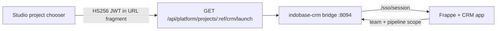

# Indobase CRM — leads, deals, and sales pipeline

Indobase CRM (`indobase-crm/`) gives every organization and project a **sales workspace**: leads, deals, Kanban boards, and custom views. The engine is [Frappe CRM](https://github.com/frappe/crm) (AGPL-3.0); customer-facing branding is **CRM** only — see [INDOBASE-ECOSYSTEM-NAMING.md](./INDOBASE-ECOSYSTEM-NAMING.md).

| Host (prod) | Host (staging) |
|---|---|
| `crm.indobase.in` | `crm.indobase.fun` |

## Customer naming

| Use | Name |
|---|---|
| Product (chooser, launch, titles) | **CRM** |
| Descriptor only | Sales |
| Never in UI | Frappe CRM, Frappe, upstream module labels |

Control plane: Vyom **103.190.92.249** (same pattern as Discuss, Workspace, Email).

---

## Architecture (vertical slice)



| Layer | Role |
|---|---|
| **Studio** | Mints `aud=indobase-crm` handoff JWT; org role gate (owner/admin/developer/viewer) |
| **Bridge** | `/sso/launch` fragment exchange, session cookie, optional `/c/*` + `/crm/*` proxy |
| **Frappe app** `indobase_crm` | Verifies JWT, provisions team/pipeline scope, logs user into CRM |
| **Frappe CRM** | Leads, deals, Kanban, custom views (upstream UI at `/crm`) |

Studio session SSO only — no separate email/password login (same as Discuss, Workspace, Email).

---

## Org / project → team / pipeline mapping

| Indobase | CRM scope | Stable key |
|---|---|---|
| Organization slug | Sales team | `ib-crm-org-{sanitized_org_slug}` |
| Project ref | Pipeline | `ib-crm-proj-{sanitized_project_ref}` |

Implementation is duplicated in three places (must stay in sync):

- `indobase-crm/bridge/src/crm-map.ts`
- `indobase-crm/frappe-app/.../utils/crm_map.py`
- `apps/studio/lib/api/saas/crm-launch-shared.ts`

Custom fields on install (`indobase_crm.install`):

- `CRM Organization.indobase_team_key`, `indobase_org_slug`
- `CRM Lead.indobase_team_key`, `indobase_pipeline_key`
- `CRM Deal.indobase_team_key`, `indobase_pipeline_key`

Deep link after SSO: `/c/{team_key}/{pipeline_key}` (bridge proxies to `/crm?ib_pipeline=…` upstream).

**Role mapping**

| Studio org role | CRM role |
|---|---|
| owner, admin, developer | Sales Manager (can edit) |
| viewer | Sales User (view-focused) |

---

## SSO contract

Same shape as other ecosystem products (`product-handoff.ts`):

| Claim | Value |
|---|---|
| `aud` | `indobase-crm` |
| `iss` | Studio origin |
| `sub` | GoTrue user id |
| `email` | Primary email |
| `organization_slug` | SaaS org slug |
| `project_ref` | Project ref |
| `project_name` | Display name |
| `role` | owner \| admin \| developer \| viewer |
| `exp` | ~5 minutes |

**Secrets:** `CRM_HANDOFF_SECRET` on CRM + `STUDIO_HANDOFF_SECRET` (or product-specific) on Studio — minimum 32 chars.

**Launch URL**

```
https://crm.indobase.in/sso/launch?project_ref={ref}&from=studio#token={jwt}
```

Flow:

1. Browser loads `/sso/launch` (token in fragment).
2. Bridge POST `/sso/session` with token.
3. Bridge calls Frappe `indobase_crm.api.studio_handoff.exchange` when configured.
4. Session cookie `indobase_crm_session` set; redirect to project pipeline.

---

## Repo layout

```
indobase-crm/
├── bridge/                 # Node SSO + dev shell + CRM proxy
├── frappe-app/indobase_crm/  # Handoff + provisioning + rebrand hooks
├── docker/deploy/          # Compose + Traefik for .249
└── NOTICE.md               # AGPL attribution
```

Studio integration:

- `apps/studio/lib/api/saas/product-handoff.ts` — `crm` product entry
- `apps/studio/lib/api/saas/crm-launch.ts` — launch redirect helper
- `apps/studio/lib/api/saas/crm-launch-shared.ts` — client-safe key helpers
- `apps/studio/pages/api/platform/projects/[ref]/crm/launch.ts` — launch API
- `apps/studio/components/interfaces/ProjectExperienceChooser/` — tile + `useCrmLaunch`
- `apps/studio/components/interfaces/ProjectExperienceChooser/CrmSidebarNavItem.tsx`
- `apps/studio/lib/constants/ecosystem-products.ts` — customer copy

---

## Local dev

**Bridge only** (no Frappe upstream):

```bash
cd indobase-crm/bridge
npm install
CRM_HANDOFF_SECRET="$(openssl rand -hex 32)" npm run dev
curl -s http://localhost:8094/sso/health | jq
```

**Full stack:**

```bash
cd indobase-crm/docker/deploy
cp .env.example .env   # set MARIADB_ROOT_PASSWORD, CRM_HANDOFF_SECRET
docker compose up -d
```

First boot initializes Frappe bench + CRM app (~5–10 min).

---

## Vyom `.249` deploy checklist

1. DNS: `crm.indobase.in` / `crm.indobase.fun` → `103.190.92.249`
2. Set `CRM_HANDOFF_SECRET` (≥32 chars) — match Studio `CRM_HANDOFF_SECRET` or shared `STUDIO_HANDOFF_SECRET`
3. Deploy compose: `cd indobase-crm/docker/deploy && docker compose up -d`
4. Traefik routes `crm.*` → `crm-bridge:8094` (labels in compose or `traefik-indobase-crm.yml`)
5. Smoke: `curl -sS https://crm.indobase.in/sso/health` → `aud=indobase-crm`, `handoffConfigured: true`
6. Studio: open project → **Open CRM** → lands on pipeline for that project

---

## What's left (post-slice)

- Upstream CRM UI rebrand hooks (hide Frappe chrome in SPA shell)
- Pipeline-scoped list filters wired in CRM Lead/Deal queries
- Twilio/Exotel/WhatsApp integration config per org (upstream CRM features)
- Swarm service on `.249` alongside Discuss/Workspace (CI image tag optional)
- Staging smoke on `crm.indobase.fun` before prod promotion
