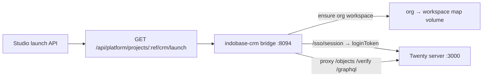

# Indobase CRM — leads, deals, and sales pipeline

Indobase CRM (`indobase-crm/`) gives every **organization** an isolated sales workspace (people, companies, opportunities, pipelines). The engine is [Twenty](https://github.com/twentyhq/twenty) (AGPL-3.0); customer-facing branding is **CRM** only — see [INDOBASE-ECOSYSTEM-NAMING.md](./INDOBASE-ECOSYSTEM-NAMING.md) and `indobase-crm/NOTICE.md`.

| Prod | Staging |
|---|---|
| `crm.indobase.in` | `crm.indobase.fun` |

## Naming

| Context | Use |
|---|---|
| Product (chooser, launch, titles) | **CRM** / Indobase CRM |
| Never in UI | Twenty, Twenty CRM, Frappe CRM, upstream marketing names |

## Architecture



| Layer | Role |
|---|---|
| **Studio** | Mints `aud=indobase-crm` handoff JWT; org role gate |
| **Bridge** | `/sso/launch` exchange, session cookie, **per-org workspace provision**, Twenty loginToken → `/verify`, branded proxy |
| **Twenty** | CRM data model + UI (never named in customer chrome); `IS_MULTIWORKSPACE_ENABLED=true` |

## Org / project isolation

| Indobase | CRM scope | Isolation |
|---|---|---|
| Organization slug | `ib-crm-org-{sanitized}` → Twenty **workspace** | **Hard** — separate workspace schema / invite hash |
| Project ref | `ib-crm-proj-{sanitized}` as `ib_pipeline` query | **Soft** — landing / naming filter only (not engine RLS) |

Deep link after SSO: `/objects/opportunities?ib_team=…&ib_pipeline=…`.

Shared helpers:

- `indobase-crm/bridge/src/crm-map.ts`
- `indobase-crm/bridge/src/workspace-map.ts` (durable org → `{workspaceId, inviteHash, subdomain}`)
- `apps/studio/lib/api/saas/crm-launch-shared.ts`

### Provisioning on SSO

1. Lookup `teamKey` in the bridge workspace map (volume `crm_bridge_data`).
2. If mapped: sign in or `signUpInWorkspace` with that org’s invite hash.
3. If missing: `signUp` / `signIn` → `signUpInNewWorkspace` (subdomain from team key) → `activateWorkspace` → persist invite hash.
4. Optional legacy: if the map is empty and `TWENTY_WORKSPACE_INVITE_HASH` is set, the first org claims that workspace (migration from single-workspace bootstraps). Fresh installs leave it blank.

Users stay on `crm.indobase.in`. The bridge rewrites GraphQL `origin` to the synthetic workspace subdomain so Twenty multi-workspace auth works without wildcard DNS in the browser.

**Project-level hard isolation is not promised** — Twenty does not give us easy per-project RLS via the SSO bridge. Treat `ib_pipeline` as soft scope.

## Handoff contract

| Claim | Notes |
|---|---|
| `aud` | `indobase-crm` |
| `email` | Studio user email (CRM login identity) |
| `role` | `owner` \| `admin` \| `developer` \| `viewer` |
| `project_ref` / `organization_slug` | Scope keys (org → workspace; project → soft filter) |

**Secrets:** `CRM_HANDOFF_SECRET` on CRM bridge + Studio (≥32 chars). Twenty needs `TWENTY_APP_SECRET`, `TWENTY_ENCRYPTION_KEY` (`openssl rand -base64 32`), and Postgres password.

Launch URL:

```
https://crm.indobase.in/sso/launch?project_ref={ref}&from=studio#token={jwt}
```

## Deploy (Vyom `.249`)

1. DNS: `crm.indobase.in` → `103.190.92.249`
2. `cd /opt/indobase-crm/docker/deploy` — set `.env` from `.env.example`
3. Keep `TWENTY_ALLOW_BOOTSTRAP_WORKSPACE=true` (per-org create). Leave `TWENTY_WORKSPACE_INVITE_HASH` empty for fresh installs.
4. `docker compose up -d --build` (first boot: DB init + upgrade before `:3000` listens, often 5–10m)
5. Smoke: `curl -sS https://crm.indobase.in/sso/health` → `handoffConfigured: true`, `upstreamConfigured: true`, `workspaceMapping: "per-org"`
6. Studio → **Open CRM** from two different orgs — each gets its own workspace (`mappedWorkspaces` increments)

### Migration note (engine swap era)

Prod CRM had **zero** Twenty workspaces when multi-tenant landed — wipe was unnecessary. If you ever have one shared workspace and an empty map, either wipe CRM Postgres volumes or set `TWENTY_WORKSPACE_INVITE_HASH` so the first org claims it. Prefer wipe when data is disposable.

## Layout

```
indobase-crm/
├── bridge/                 # Node SSO + proxy + org workspace map
├── docker/deploy/          # Twenty + Postgres + Redis + bridge
├── NOTICE.md
└── README.md
```
