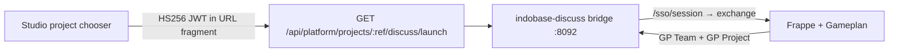

# Indobase Discuss — team / org / project async chat

Indobase Discuss (`indobase-discuss/`) gives every organization and project **team chat**: spaces, threads, and pages. The engine is [Gameplan](https://github.com/frappe/gameplan) (AGPL-3.0) on Frappe v16+; customer-facing branding is **Discuss** only — see [INDOBASE-ECOSYSTEM-NAMING.md](./INDOBASE-ECOSYSTEM-NAMING.md).

| Host (prod) | Host (staging) |
|---|---|
| `discuss.indobase.in` | `discuss.indobase.fun` |

## Customer naming

| Use | Name |
|---|---|
| Product (chooser, launch, titles) | **Discuss** |
| Descriptor only | Team chat |
| Never in UI | Gameplan, Frappe, Mattermost, GP Team/Project labels |

Control plane: Vyom **103.190.92.249** (same pattern as Email, Social, Design).

---

## Architecture (vertical slice)



| Layer | Role |
|---|---|
| **Studio** | Mints `aud=indobase-discuss` handoff JWT; org role gate (owner/admin/developer/viewer) |
| **Bridge** | `/sso/launch` fragment exchange, session cookie, `/g/*` proxy + HTML rebrand |
| **Frappe app** `indobase_discuss` | Verifies JWT, provisions Team/Space, logs user into Gameplan |
| **Gameplan** | Discussions, threads, tasks, pages (upstream UI at `/g/…`) |

We deliberately **do not** expose a separate email/password login — Studio session SSO only (same as Email, Social, Design). Cold visits show a product landing with Studio / resume CTAs (no blind bounce).

---

## Org / project → Space mapping

| Indobase | Gameplan | Stable key |
|---|---|---|
| Organization slug | **GP Team** (community) | `ib-org-{sanitized_org_slug}` |
| Project ref | **GP Project** (space) | `ib-proj-{sanitized_project_ref}` |

Implementation is duplicated in three places (must stay in sync):

- `indobase-discuss/bridge/src/space-map.ts`
- `indobase-discuss/frappe-app/.../utils/space_map.py`
- `apps/studio/lib/api/saas/discuss-launch-shared.ts`

Custom fields on install (`indobase_discuss.install`):

- `GP Team.indobase_team_key`, `indobase_org_slug`
- `GP Project.indobase_space_key`, `indobase_project_ref`

Deep link after SSO: `/g/{team_doc_name}/{space_doc_name}` (Frappe document names from exchange — not raw keys alone).

**Role mapping**

| Studio org role | Gameplan role |
|---|---|
| owner, admin, developer | Gameplan Member (can post) |
| viewer | Gameplan Guest (read-focused) |

---

## SSO contract

Same shape as other ecosystem products (`product-handoff.ts`):

| Claim | Value |
|---|---|
| `aud` | `indobase-discuss` |
| `iss` | Studio origin |
| `sub` | GoTrue user id |
| `email` | Primary email |
| `organization_slug` | SaaS org slug |
| `project_ref` | Project ref |
| `project_name` | Display name |
| `role` | owner \| admin \| developer \| viewer |
| `exp` | ~5 minutes |

**Secrets:** `DISCUSS_HANDOFF_SECRET` on Discuss + `STUDIO_HANDOFF_SECRET` (or `DISCUSS_HANDOFF_SECRET`) on Studio — minimum 32 chars. Never fall back to `AUTH_JWT_SECRET`.

**Launch URL**

```
https://discuss.indobase.in/sso/launch?project_ref={ref}&from=studio#token={jwt}
```

Flow:

1. Browser loads `/sso/launch` (token in fragment).
2. Bridge POST `/sso/session` with token; verifies HS256 JWT.
3. Bridge calls Frappe `indobase_discuss.api.studio_handoff.exchange`.
4. Frappe session cookies + bridge `indobase_discuss_session`; redirect to project space.

`/sso/health` returns `{ ok, service, audience, version, handoffConfigured, upstreamReady }` — no internal hostnames.

---

## Repo layout

```
indobase-discuss/
├── bridge/                        # Node SSO + Gameplan proxy + brand rewrite
├── frappe-app/indobase_discuss/   # Handoff + provisioning + rebrand hooks
├── docker/
│   ├── init-gameplan.sh           # First-boot Frappe v16 + Gameplan develop
│   └── deploy/                    # Compose + Traefik for .249
├── vendor/gameplan/               # Optional local submodule pointer
└── NOTICE.md                      # AGPL attribution
```

Studio integration (unchanged contract):

- `apps/studio/lib/api/saas/product-handoff.ts` — `discuss` product entry
- `apps/studio/lib/api/saas/discuss-launch.ts` — launch helper
- `apps/studio/pages/api/platform/projects/[ref]/discuss/launch.ts`
- `ProjectExperienceChooser` / `useDiscussLaunch` / `DiscussSidebarNavItem`

---

## Local development

**Bridge only (fast path):**

```bash
cd indobase-discuss/bridge
pnpm install
DISCUSS_HANDOFF_SECRET="$(openssl rand -hex 32)" pnpm dev
curl -sS http://localhost:8092/sso/health
```

**Full stack:**

```bash
cd indobase-discuss/docker/deploy
cp .env.example .env   # set DISCUSS_HANDOFF_SECRET, MARIADB_ROOT_PASSWORD
docker compose up -d --build
```

First Gameplan boot can take several minutes (bench init + yarn build).

---

## Deploy checklist for Vyom `.249`

1. DNS: `discuss.indobase.in` / `.fun` → `.249` (not tenant `.248`).
2. Stop/remove the Mattermost Discuss compose stack and volumes if present (`discuss_postgres_data`, `discuss_mattermost_*`).
3. Set `DISCUSS_HANDOFF_SECRET` on Studio Swarm env + Discuss compose (match `STUDIO_HANDOFF_SECRET`, ≥32 chars).
4. `cd /opt/indobase-discuss/docker/deploy`, sync tree, `cp .env.example .env`, fill secrets.
5. Chown bench volume for uid 1000:  
   `docker run --rm -v indobase-discuss_discuss_bench_sites:/v alpine chown -R 1000:1000 /v`
6. Ensure `docker/init-gameplan.sh` is mode `755`.
7. `GIT_SHA=$(git rev-parse HEAD) docker compose up -d --build`
8. Confirm Traefik router `indobase-discuss` → bridge `:8092`.
9. Smoke: `curl -sS https://discuss.indobase.in/sso/health` → `handoffConfigured` + `upstreamReady` (upstreamReady may lag until bench finishes first boot).
10. Studio → **Discuss** → lands on project space; no Gameplan/Frappe/Mattermost in title chrome we control.

**Data migration:** Mattermost → Gameplan is **not** supported. Fresh Discuss volumes.

---

## AGPL

Gameplan is AGPL-3.0. Keep `NOTICE.md` and upstream LICENSE compliance. Customer UI must not say "Gameplan" or "Frappe".
