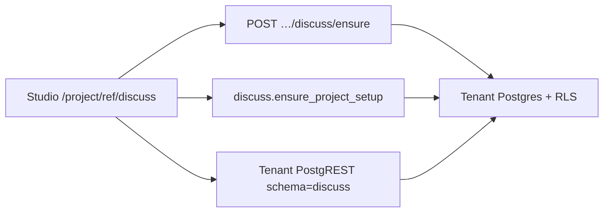

# Indobase Discuss — native team chat inside Studio

Indobase Discuss is a **Studio surface** at `/project/[ref]/discuss`. Conversation lives in each
project's **tenant Postgres** under the `discuss` schema, isolated by **FORCE RLS**. There is no
separate Discuss login, no SSO handoff, and no third-party chat process to keep in sync.

| Surface | URL |
|---|---|
| Studio route | `https://studio.indobase.in/project/{ref}/discuss` |
| Product name | **Discuss** (never Mattermost / Gameplan / Frappe in UI) |

---

## Why native

Previous Mattermost and Gameplan forks failed on handoff secrets, blank SPAs, and silent channel
provisioning. Building Discuss inside Studio removes that class of bug: the Studio session is the
auth, and Postgres RLS is the tenancy boundary.

---

## Architecture



| Layer | Role |
|---|---|
| **Studio UI** | Channels, transcript, threads, activity cards |
| **Temporary API key** | Short-lived `authenticated` JWT (`sub` = Studio gotrue id, `project_ref` = project) |
| **`discuss` schema** | members, channels, messages, … — FORCE RLS, membership scoped by JWT `project_ref` |
| **Platform publishers** | Deploys, builds, payments, KYC → Activity channel via `discuss.publish_event` |

---

## Slack-parity features (in progress)

| Feature | Status |
|---|---|
| Channels + Activity feed | Done |
| 1:1 DMs | Done |
| Create channel (public/private) | Done |
| Threads (one level) | Done |
| Edit / soft-delete own messages | Done |
| Emoji reactions | Done |
| @mentions (autocomplete + highlight) | Done |
| Full-text search UI | Done |
| Unread + realtime | Done |
| File / image uploads (Storage + attachments) | Done |
| In-app notifications (mentions, DMs, replies) | Done |
| Presence + typing indicators | Done |
| Group DMs | Done |
| Channel archive / unarchive UX | Done |
| Mobile layout | Out of scope for now |

---

## Repo layout

```
indobase-discuss/db/          # Tenant DDL (001–006; ensure re-applies all)
apps/studio/
  pages/project/[ref]/discuss.tsx
  pages/api/platform/projects/[ref]/discuss/ensure.ts
  pages/api/platform/projects/[ref]/api-keys/temporary.ts
  components/interfaces/Discuss/
  data/discuss/
  lib/api/saas/discuss-events.ts
  lib/api/saas/discuss-schema.ts
```

Legacy Gameplan bridge code under `indobase-discuss/bridge/` is superseded for product UX; do not
route Studio "Open Discuss" through SSO.

---

## Tenant requirements

1. Dedicated tenant database preferred (one project ↔ one DB). On a shared DB, JWT `project_ref`
   scopes `discuss.current_member_ids()` so projects stay isolated.
2. `discuss` schema installed (Studio calls `/discuss/ensure` on open — applies 001–006).
3. PostgREST exposes `discuss`: new stacks set `PGRST_DB_SCHEMAS`; ensure also best-effort
   `ALTER ROLE authenticator … pgrst.db_schemas` + `NOTIFY pgrst` reload. Older stacks may still
   need a compose repair if in-DB config is disabled.
4. Temporary API keys mint project-scoped JWTs with `role=authenticated`, `sub=<gotrue id>`, and
   `project_ref=<ref>` (not a global service key).

---

## Multitenancy

Isolation is **per project**, enforced in Postgres:

1. Studio mints a temporary JWT with `project_ref` for that project.
2. `discuss.current_member_ids()` only returns the caller's member row(s) for that `project_ref`.
3. Channel / message policies hang off that membership set (plus private-channel membership).

Dedicated tenant DBs are still preferred; shared DBs stay safe as long as Discuss tokens carry
`project_ref` (asserted client-side before use).

---

## Role mapping

| Studio org role | Discuss role |
|---|---|
| Owner | owner |
| Administrator | admin |
| Developer | developer |
| Read-only | viewer (read-only; `messages_write` rejects inserts) |

---

## Platform events

`publishDiscussEvent({ type, projectRef, data })` is best-effort and never throws. Event types and
payload shapes live in `discuss-events-shared.ts` and render as Activity cards.
