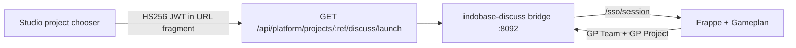

# Indobase Discuss — team / org / project async chat

Indobase Discuss (`indobase-discuss/`) gives every organization and project **team chat**: spaces, threads, and pages. The engine is [Gameplan](https://github.com/frappe/gameplan) (AGPL-3.0); customer-facing branding is **Discuss** only — see [INDOBASE-ECOSYSTEM-NAMING.md](./INDOBASE-ECOSYSTEM-NAMING.md).

| Host (prod) | Host (staging) |
|---|---|
| `discuss.indobase.in` | `discuss.indobase.fun` |

## Customer naming

| Use | Name |
|---|---|
| Product (chooser, launch, titles) | **Discuss** |
| Descriptor only | Team chat |
| Never in UI | Gameplan, Frappe, GP Team/Project labels |

Control plane: Vyom **103.190.92.249** (same pattern as Email, Social, Design).

---

## Architecture (vertical slice)



| Layer | Role |
|---|---|
| **Studio** | Mints `aud=indobase-discuss` handoff JWT; org role gate (owner/admin/developer/viewer) |
| **Bridge** | `/sso/launch` fragment exchange, session cookie, optional `/g/*` proxy |
| **Frappe app** `indobase_discuss` | Verifies JWT, provisions Team/Space, logs user into Gameplan |
| **Gameplan** | Discussions, threads, tasks, pages (upstream UI at `/g/…`) |

We deliberately **do not** expose a separate email/password login — Studio session SSO only (same as Email, Social, Design).

---

## Org / project → Space mapping

| Indobase | Gameplan | Stable key |
|---|---|---|
| Organization slug | **GP Team** (community) | `ib-org-{sanitized_org_slug}` |
| Project ref | **GP Project** (space) | `ib-proj-{sanitized_project_ref}` |

Implementation is duplicated in three places (must stay in sync):

- `indobase-discuss/bridge/src/space-map.ts`
- `indobase-discuss/frappe-app/.../utils/space_map.py`
- `apps/studio/lib/api/saas/discuss-launch-shared.ts`

Custom fields on install (`indobase_discuss.install`):

- `GP Team.indobase_team_key`, `indobase_org_slug`
- `GP Project.indobase_space_key`, `indobase_project_ref`

Deep link after SSO: `/g/{team_key}/{space_key}`.

**Role mapping**

| Studio org role | Gameplan role |
|---|---|
| owner, admin, developer | Gameplan Member (can post) |
| viewer | Gameplan Guest (read-focused) |

---

## SSO contract

Same shape as other ecosystem products (`product-handoff.ts`):

| Claim | Value |
|---|---|
| `aud` | `indobase-discuss` |
| `iss` | Studio origin |
| `sub` | GoTrue user id |
| `email` | Primary email |
| `organization_slug` | SaaS org slug |
| `project_ref` | Project ref |
| `project_name` | Display name |
| `role` | owner \| admin \| developer \| viewer |
| `exp` | ~5 minutes |

**Secrets:** `DISCUSS_HANDOFF_SECRET` on Discuss + `STUDIO_HANDOFF_SECRET` (or product-specific) on Studio — minimum 32 chars.

**Launch URL**

```
https://discuss.indobase.in/sso/launch?project_ref={ref}&from=studio#token={jwt}
```

Flow:

1. Browser loads `/sso/launch` (token in fragment).
2. Bridge POST `/sso/session` with token.
3. Bridge calls Frappe `indobase_discuss.api.studio_handoff.exchange` when configured.
4. Session cookie `indobase_discuss_session` set; redirect to project space.

---

## Repo layout

```
indobase-discuss/
├── bridge/                 # Node SSO + dev shell + Gameplan proxy
├── frappe-app/indobase_discuss/  # Handoff + provisioning + rebrand hooks
├── docker/deploy/          # Compose + Traefik for .249
└── NOTICE.md               # AGPL attribution
```

Studio integration:

- `apps/studio/lib/api/saas/product-handoff.ts` — `discuss` product entry
- `apps/studio/lib/api/saas/discuss-launch.ts` — launch helper
- `apps/studio/pages/api/platform/projects/[ref]/discuss/launch.ts`
- `ProjectExperienceChooser` — **Discuss** tile (descriptor: team chat)
- `DiscussSidebarNavItem` — project sidebar SSO entry

---

## Local development

**Bridge only (fast path):**

```bash
cd indobase-discuss/bridge
pnpm install
DISCUSS_HANDOFF_SECRET="$(openssl rand -hex 32)" pnpm dev
curl -sS http://localhost:8092/sso/health
```

**Full stack:**

```bash
cd indobase-discuss/docker/deploy
cp .env.example .env   # set DISCUSS_HANDOFF_SECRET, MARIADB_ROOT_PASSWORD
docker compose up -d
```

First Gameplan boot can take several minutes (bench init).

---

## Deploy checklist for Vyom `.249` (not done in this change)

1. Add DNS: `discuss.indobase.in` / `.fun` → `.249`.
2. Set `DISCUSS_HANDOFF_SECRET` on Studio Swarm env + Discuss compose (match `STUDIO_HANDOFF_SECRET`).
3. Deploy compose stack; confirm Traefik router `indobase-discuss`.
4. Smoke: Studio → **Discuss** → lands on project space; no Gameplan/Frappe strings in title/footer.
5. Optional CI: add `roshanraghavander/indobase-discuss:<sha>` image build to `docker-publish.yml`.
6. Gameplan frontend rebrand pass (replace visible "Gameplan" strings in built assets / fixtures) — tracked as follow-up; hooks set `app_icon_title = Discuss`.

---

## AGPL

Gameplan is AGPL-3.0. We keep upstream LICENSE/NOTICE and ship source access per license. Customer UI must not say "Gameplan" or "Frappe".
