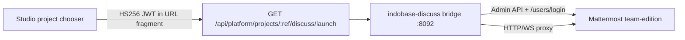

# Indobase Discuss — team / org / project async chat

Indobase Discuss (`indobase-discuss/`) gives every organization and project **team chat**: channels and threads. The engine is [Mattermost](https://github.com/mattermost/mattermost) Team Edition (AGPL-3.0); customer-facing branding is **Discuss** only — see [INDOBASE-ECOSYSTEM-NAMING.md](./INDOBASE-ECOSYSTEM-NAMING.md).

| Host (prod) | Host (staging) |
|---|---|
| `discuss.indobase.in` | `discuss.indobase.fun` |

## Customer naming

| Use | Name |
|---|---|
| Product (chooser, launch, titles) | **Discuss** |
| Descriptor only | Team chat |
| Never in UI | Mattermost, Gameplan, Frappe |

Control plane: Vyom **103.190.92.249** (same pattern as Email, Social, Design).

---

## Architecture (vertical slice)



| Layer | Role |
|---|---|
| **Studio** | Mints `aud=indobase-discuss` handoff JWT; org role gate (owner/admin/developer/viewer) |
| **Bridge** | `/sso/launch` fragment exchange, Mattermost session cookies, reverse proxy to upstream |
| **Mattermost** | Teams, channels, messages (official Docker image — not vendored) |

We deliberately **do not** expose a separate email/password login — Studio session SSO only (same as Email, Social, Design). Bridge redirects `/login` and signup routes to Studio.

---

## Org / project → team / channel mapping

| Indobase | Discuss (Mattermost) | Stable key |
|---|---|---|
| Organization slug | **Team** (`name`) | `ib-org-{sanitized_org_slug}` |
| Project ref | **Channel** (`name`, private) | `ib-proj-{sanitized_project_ref}` |

Implementation (must stay in sync):

- `indobase-discuss/bridge/src/space-map.ts`
- `apps/studio/lib/api/saas/discuss-launch-shared.ts`

Deep link after SSO: `/{team_key}/channels/{space_key}`.

**Role mapping**

| Studio org role | Team membership |
|---|---|
| owner, admin, developer | `team_user team_admin` (can post) |
| viewer | `team_user` |

---

## SSO contract

Same shape as other ecosystem products (`product-handoff.ts`):

| Claim | Value |
|---|---|
| `aud` | `indobase-discuss` |
| `iss` | Studio origin |
| `sub` | GoTrue user id |
| `email` | Primary email |
| `organization_slug` | SaaS org slug |
| `project_ref` | Project ref |
| `project_name` | Display name |
| `role` | owner \| admin \| developer \| viewer |
| `exp` | ~5 minutes |

**Secrets:** `DISCUSS_HANDOFF_SECRET` on Discuss + `STUDIO_HANDOFF_SECRET` (or `DISCUSS_HANDOFF_SECRET`) on Studio — minimum 32 chars.

**Launch URL**

```
https://discuss.indobase.in/sso/launch?project_ref={ref}&from=studio#token={jwt}
```

Flow:

1. Browser loads `/sso/launch` (token in fragment).
2. Bridge `POST /sso/session` with token; verifies HS256 JWT.
3. Bridge (admin PAT) ensures user + org team + project channel; sets password; calls `/api/v4/users/login`.
4. Sets `MMAUTHTOKEN` / `MMUSERID` (+ bridge `indobase_discuss_session`); redirects to channel path.

`/sso/health` returns `{ ok, service, audience, version, handoffConfigured, upstreamReady }` — no internal hostnames.

---

## Repo layout

```
indobase-discuss/
├── bridge/                      # Node SSO + Mattermost proxy
│   └── src/mattermost.ts        # Admin API exchange
├── docker/
│   ├── bootstrap-mattermost.sh  # First-boot admin PAT → /secrets/admin_token
│   └── deploy/                  # Compose + Traefik for .249
└── NOTICE.md                    # AGPL attribution
```

Studio integration (unchanged contract):

- `apps/studio/lib/api/saas/product-handoff.ts` — `discuss` product entry
- `apps/studio/lib/api/saas/discuss-launch.ts` — launch helper
- `apps/studio/pages/api/platform/projects/[ref]/discuss/launch.ts`
- `ProjectExperienceChooser` / `useDiscussLaunch` / `DiscussSidebarNavItem`

---

## Local development

**Bridge only (fast path):**

```bash
cd indobase-discuss/bridge
pnpm install
DISCUSS_HANDOFF_SECRET="$(openssl rand -hex 32)" pnpm dev
curl -sS http://localhost:8092/sso/health
```

**Full stack:**

```bash
cd indobase-discuss/docker/deploy
cp .env.example .env   # set DISCUSS_HANDOFF_SECRET, POSTGRES_PASSWORD, MATTERMOST_ADMIN_PASSWORD
docker compose up -d --build
```

---

## Deploy checklist for Vyom `.249` (manual — not run unless asked)

1. DNS: `discuss.indobase.in` / `.fun` → `.249` (not tenant `.248`).
2. Stop/remove the old Gameplan/Frappe Discuss compose stack and volumes if present (`discuss_bench_sites`, MariaDB).
3. Set `DISCUSS_HANDOFF_SECRET` on Studio Swarm env + Discuss compose (match `STUDIO_HANDOFF_SECRET`).
4. `cd /opt/indobase-discuss/docker/deploy` (or sync this tree), `cp .env.example .env`, fill secrets.
5. `docker compose up -d --build`
6. Confirm Traefik router `indobase-discuss` → bridge `:8092`.
7. Smoke: `curl -sS https://discuss.indobase.in/sso/health` → `handoffConfigured` + `upstreamReady`.
8. Studio → **Discuss** → lands on project channel; no Mattermost/Gameplan/Frappe in title chrome we control.
9. Optional CI: build `roshanraghavander/indobase-discuss:<sha>` for the bridge image.

**Data migration:** Gameplan → Mattermost is **not** supported. Fresh Discuss; treat prior Gameplan data as abandoned unless a one-off export is requested later.

---

## AGPL

Mattermost is AGPL-3.0. Keep `NOTICE.md` and upstream LICENSE compliance. Customer UI must not say "Mattermost".
