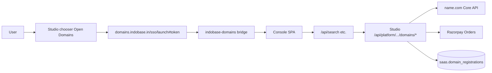
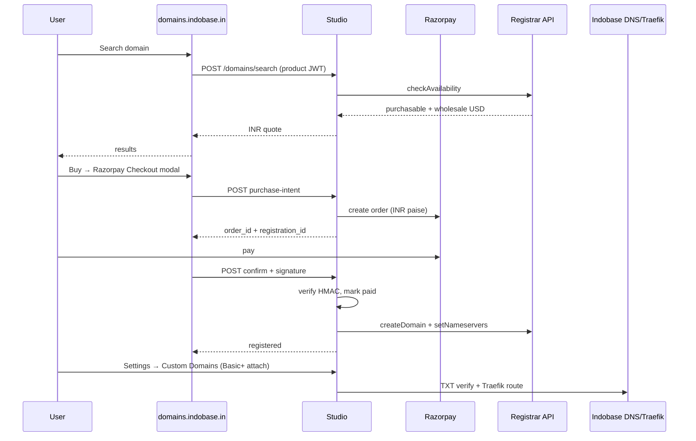

# Indobase Domains

Customer-facing product name: **Domains** (“Open Domains” in Studio chooser). The registrar provider (name.com Core API) is **server-only** — never shown in Domains UI, emails, or Builder.

## Product surface

| Host | Role |
|------|------|
| `domains.indobase.in` | Production Domains app (Vyom `.249`) |
| `domains.indobase.fun` | Staging |
| `studio.indobase.in` | SSO issuer + domains API backend |

Standalone app: `indobase-domains/` (Hono bridge + Vite console). Studio keeps registrar, Razorpay, and `saas.domain_registrations`.

## Architecture (Option A)



**Why Option A:** Reuses existing Studio domain modules and DB; Domains app is a thin SSO + UI shell. No duplicate registrar credentials on a second service.

**Product API auth:** Bridge mints short-lived JWT (`aud=indobase-domains-api`) signed with `DOMAINS_HANDOFF_SECRET`; Studio `domainsApiWrapper` accepts that bearer or a normal Studio session.

## SSO contract

| Item | Value |
|------|-------|
| Handoff JWT `aud` | `indobase-domains` |
| Launch URL | `{INDOBASE_DOMAINS_URL}/sso/launch?project_ref={ref}&from=studio#token=…` |
| Session cookie | `indobase_domains_session` (12h, HttpOnly) |
| API bearer `aud` | `indobase-domains-api` (15m) |
| Secret | `DOMAINS_HANDOFF_SECRET` (≥32 chars; shared with Studio) |

Minting: `apps/studio/lib/api/saas/product-handoff.ts` + `pages/api/platform/projects/[ref]/domains/launch.ts`.

## Why name.com (not ResellerClub)

| | name.com Core API | ResellerClub |
|---|-------------------|--------------|
| Auth | HTTP Basic (username + API token) | API key + often IP whitelist |
| Sandbox | `api.dev.name.com` with `-test` username | Separate reseller sandbox |
| Docs | OpenAPI + MCP | Legacy XML/REST mix |
| Fit | Reseller quickstart matches “charge customer → register domain” | Heavier onboarding, IP lock-in |

Indobase already uses Razorpay for plan billing; Domains adds **one-time Razorpay orders** for registration, then calls the registrar with **pre-funded reseller account credit**.

## Environments

| | Production | Sandbox (OT&E) |
|---|------------|----------------|
| Base URL | `https://api.name.com` | `https://api.dev.name.com` |
| Username | Reseller username | Same username + `-test` suffix |
| Token | Production API token | Separate sandbox token |
| Charges | Real USD account credit | Preloaded test credit |

Sandbox tokens can take **up to ~15 minutes** to activate after creation. Some TLDs/prices differ from production.

References:

- Getting started: https://docs.name.com/guides/getting-started
- OpenAPI: https://docs.name.com/namecom.api.yaml
- Reseller quickstart: https://docs.name.com/guides/quickstart

## Environment variables

### Studio (control-plane)

Set on Studio / control-plane only. **Never** expose tokens to the browser.

```bash
# Domains product
DOMAINS_HANDOFF_SECRET=                         # shared with indobase-domains bridge
INDOBASE_DOMAINS_URL=https://domains.indobase.in

# Registrar (name.com Core API)
NAMECOM_USERNAME=indobase-reseller
NAMECOM_API_TOKEN=
NAMECOM_API_BASE=https://api.dev.name.com      # sandbox; omit or https://api.name.com for prod

# Customer pricing (USD wholesale → INR retail)
DOMAINS_USD_TO_INR_RATE=83
DOMAINS_PRICE_MARKUP_BPS=1500                   # 1500 = 15% margin

# DNS after registration
INDOBASE_DOMAIN_NAMESERVERS=ns1.indobase.in,ns2.indobase.in

# Checkout (existing Razorpay keys)
RAZORPAY_KEY_ID=
RAZORPAY_KEY_SECRET=
```

### indobase-domains bridge (`.249`)

```bash
DOMAINS_HANDOFF_SECRET=                         # same as Studio
STUDIO_PUBLIC_URL=https://studio.indobase.in
STUDIO_INTERNAL_URL=http://indobase-studio:8080   # Swarm DNS on .249
PORT=8094
```

Optional Traefik custom-hostname path (existing custom domain attach flow):

```bash
CUSTOM_DOMAIN_TRAEFIK_DIR=/path/to/traefik/dynamic
```

## Purchase sequence



**Order of operations:** always **Razorpay payment first**, then **registrar register** from funded reseller balance. On registrar failure after payment, ops must refund manually or via Razorpay dashboard until automated refund webhooks exist.

## API routes (Studio)

All under `/api/platform/projects/[ref]/domains/` — Studio session **or** `indobase-domains-api` bearer:

| Route | Method | Purpose |
|-------|--------|---------|
| `launch` | GET | Mint SSO redirect URL (Studio session only) |
| `search` | POST | Availability + INR quote |
| `pricing?tld=com` | GET | TLD list price + INR quote |
| `purchase-intent` | POST | Create `saas.domain_registrations` + Razorpay order |
| `confirm` | POST | Verify payment → register → set NS |
| `/` | GET | List registrations for project |

Bridge exposes `/api/search`, `/api/purchase-intent`, `/api/confirm`, `/api/registrations` (proxied).

Server modules (Studio):

- `apps/studio/lib/api/saas/namecom-client.ts`
- `apps/studio/lib/api/saas/domains-service.ts`
- `apps/studio/lib/api/saas/domains-purchase.ts`
- `apps/studio/lib/api/saas/domains-product-token.ts`

## Database (`saas.domain_registrations`)

Created lazily via `ensureDomainTables()`:

| Column | Notes |
|--------|-------|
| `domain_name`, `tld`, `years` | FQDN + term |
| `status` | `quoted` → `payment_pending` → `paid` → `registering` → `registered` / `failed` |
| `customer_price_inr_paise` | What Razorpay charged |
| `provider_purchase_price_usd` | Wholesale at quote time |
| `razorpay_order_id`, `razorpay_payment_id` | Payment audit |
| `nameservers` | Applied NS JSON |
| `project_ref`, `organization_id` | Ownership |

Purchased domains **feed** the existing **Custom Domains** attach path (`saas.custom_domains` + TXT verification + optional Traefik). Basic+ entitlement for *attaching* a hostname is unchanged; Domains is an optional **buy** path for users who do not already own a domain.

## Nameservers & DNS

After registration, Studio calls `setNameservers` with `INDOBASE_DOMAIN_NAMESERVERS`.

Production targets (confirm live glue/A records on Vyom):

- `ns1.indobase.in`, `ns2.indobase.in` → Traefik / site static proxy on `.248` / `.249`

For `*.indobase.in` tenant subdomains, continue using existing wildcard Traefik + provisioner routes; purchased **apex** domains use the custom-domain flow once NS propagate.

## UI entry points

- Project chooser: **Open Domains** → SSO to `domains.indobase.in`
- `/project/[ref]/domains` in Studio → redirects to Domains product
- Settings → Custom Domains: link “Buy a domain” → Domains product
- Builder publish menu: deep-link to Studio custom domains

## Deploy (Vyom `.249`)

- Compose: `indobase-domains/docker/deploy/docker-compose.yml`
- Traefik: `indobase-domains/docker/deploy/traefik-indobase-domains.yml`
- Build: `docker build -f indobase-domains/Dockerfile indobase-domains`

## Production checklist

- [ ] name.com reseller account + funded USD credit
- [ ] Production API token; rotate sandbox tokens separately
- [ ] Set `NAMECOM_API_BASE=https://api.name.com` on `.249` Studio
- [ ] `DOMAINS_HANDOFF_SECRET` on Studio + domains-bridge (same value)
- [ ] DNS A/AAAA for `domains.indobase.in` → `.249` Traefik
- [ ] Confirm `INDOBASE_DOMAIN_NAMESERVERS` hostnames resolve and serve customer zones
- [ ] Razorpay keys on Studio (Orders API; optional webhook for auto-confirm)
- [ ] ICANN registrant contact verification emails (support playbook)
- [ ] Premium / claims TLD flows — test `.com` first
- [ ] Monitoring: registrar balance low alerts, failed `registering` rows

## Security

- Token auth only — **no IP whitelist** (advantage over ResellerClub).
- Enable “API Access” in name.com account if 2FA is on.
- Never log `NAMECOM_API_TOKEN` or return wholesale USD to clients (margin is Indobase retail INR only).
- Product API JWT is short-lived and scoped to one `project_ref`.
