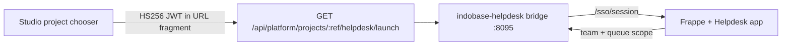

# Indobase Helpdesk — tickets, SLAs, and customer support

Indobase Helpdesk (`indobase-helpdesk/`) gives every organization and project a **support workspace**: agent desk, customer portal, SLAs, knowledge base, and assignment rules. The engine is [Frappe Helpdesk](https://github.com/frappe/helpdesk) (AGPL-3.0); customer-facing branding is **Helpdesk** only — see [INDOBASE-ECOSYSTEM-NAMING.md](./INDOBASE-ECOSYSTEM-NAMING.md).

| Host (prod) | Host (staging) |
|---|---|
| `helpdesk.indobase.in` | `helpdesk.indobase.fun` |

## Customer naming

| Use | Name |
|---|---|
| Product (chooser, launch, titles) | **Helpdesk** |
| Descriptor only | Support |
| Never in UI | Frappe Helpdesk, Frappe, upstream module labels |

Control plane: Vyom **103.190.92.249** (same pattern as CRM, Discuss, Workspace, Email).

---

## Architecture (vertical slice)



| Layer | Role |
|---|---|
| **Studio** | Mints `aud=indobase-helpdesk` handoff JWT; org role gate (owner/admin/developer/viewer) |
| **Bridge** | `/sso/launch` fragment exchange, session cookie, `/h/*` agent + `/portal/*` customer proxy |
| **Frappe app** `indobase_helpdesk` | Verifies JWT, provisions team/queue scope, logs user into Helpdesk |
| **Frappe Helpdesk** | Agent desk, customer portal, SLAs, KB (upstream UI at `/helpdesk`) |

Studio session SSO only — no separate email/password login (same as CRM, Discuss, Workspace, Email).

---

## Org / project → team / queue mapping

| Indobase | Helpdesk scope | Stable key |
|---|---|---|
| Organization slug | Support team | `ib-hd-org-{sanitized_org_slug}` |
| Project ref | Ticket queue | `ib-hd-proj-{sanitized_project_ref}` |

Implementation is duplicated in three places (must stay in sync):

- `indobase-helpdesk/bridge/src/helpdesk-map.ts`
- `indobase-helpdesk/frappe-app/.../utils/helpdesk_map.py`
- `apps/studio/lib/api/saas/helpdesk-launch-shared.ts`

Custom fields on install (`indobase_helpdesk.install`):

- `HD Team.indobase_team_key`, `indobase_org_slug`
- `HD Ticket.indobase_team_key`, `indobase_queue_key`

Deep links after SSO:

- **Agent desk:** `/h/{team_key}/{queue_key}` (bridge proxies to `/helpdesk?ib_queue=…`)
- **Customer portal:** `/portal/{team_key}/{queue_key}` (proxies to `/helpdesk/my-tickets?ib_queue=…`)

**Role mapping**

| Studio org role | Helpdesk surface | Upstream role |
|---|---|---|
| owner, admin, developer | Agent desk | Agent |
| viewer | Customer portal | Customer |

---

## SSO contract

Same shape as other ecosystem products (`product-handoff.ts`):

| Claim | Value |
|---|---|
| `aud` | `indobase-helpdesk` |
| `iss` | Studio origin |
| `sub` | GoTrue user id |
| `email` | Primary email |
| `organization_slug` | SaaS org slug |
| `project_ref` | Project ref |
| `project_name` | Display name |
| `role` | owner \| admin \| developer \| viewer |
| `exp` | ~5 minutes |

**Secrets:** `HELPDESK_HANDOFF_SECRET` on Helpdesk + `STUDIO_HANDOFF_SECRET` (or product-specific) on Studio — minimum 32 chars.

**Launch URL**

```
https://helpdesk.indobase.in/sso/launch?project_ref={ref}&from=studio#token={jwt}
```

Flow:

1. Browser loads `/sso/launch` (token in fragment).
2. Bridge POST `/sso/session` with token.
3. Bridge calls Frappe `indobase_helpdesk.api.studio_handoff.exchange` when configured.
4. Session cookie `indobase_helpdesk_session` set; redirect to agent desk or customer portal based on role.

---

## Repo layout

```
indobase-helpdesk/
├── bridge/                    # Node SSO + dev shell + Helpdesk proxy
├── frappe-app/indobase_helpdesk/  # Handoff + provisioning + rebrand hooks
├── docker/deploy/             # Compose + Traefik for .249
└── NOTICE.md                  # AGPL attribution
```

Studio integration:

- `apps/studio/lib/api/saas/product-handoff.ts` — `helpdesk` product entry
- `apps/studio/lib/api/saas/helpdesk-launch.ts` — launch redirect helper
- `apps/studio/lib/api/saas/helpdesk-launch-shared.ts` — client-safe key helpers
- `apps/studio/pages/api/platform/projects/[ref]/helpdesk/launch.ts` — launch API
- `apps/studio/components/interfaces/ProjectExperienceChooser/` — tile + `useHelpdeskLaunch`
- `apps/studio/components/interfaces/ProjectExperienceChooser/HelpdeskSidebarNavItem.tsx`
- `apps/studio/lib/constants/ecosystem-products.ts` — customer copy

---

## Local dev

**Bridge only** (no Frappe upstream):

```bash
cd indobase-helpdesk/bridge
npm install
HELPDESK_HANDOFF_SECRET="$(openssl rand -hex 32)" npm run dev
curl -s http://localhost:8095/sso/health | jq
```

**Full stack:**

```bash
cd indobase-helpdesk/docker/deploy
cp .env.example .env   # set MARIADB_ROOT_PASSWORD, HELPDESK_HANDOFF_SECRET
docker compose up -d
```

First boot initializes Frappe bench + Helpdesk app (~5–10 min).

---

## Vyom `.249` deploy checklist

1. DNS: `helpdesk.indobase.in` / `helpdesk.indobase.fun` → `103.190.92.249`
2. Set `HELPDESK_HANDOFF_SECRET` (≥32 chars) — match Studio `HELPDESK_HANDOFF_SECRET` or shared `STUDIO_HANDOFF_SECRET`
3. Deploy compose: `cd indobase-helpdesk/docker/deploy && docker compose up -d`
4. Traefik routes `helpdesk.*` → `helpdesk-bridge:8095` (labels in compose or `traefik-indobase-helpdesk.yml`)
5. Smoke: `curl -sS https://helpdesk.indobase.in/sso/health` → `aud=indobase-helpdesk`, `handoffConfigured: true`
6. Studio: open project → **Open Helpdesk** → lands on agent desk or customer portal for that project

---

## What's left (post-slice)

- Upstream Helpdesk UI rebrand hooks (hide Frappe chrome in SPA shell)
- Queue-scoped ticket list filters wired in HD Ticket queries
- SLA templates and assignment rules seeded per org team on first handoff
- Swarm service on `.249` alongside CRM/Discuss/Workspace (CI image tag optional)
- Staging smoke on `helpdesk.indobase.fun` before prod promotion
- Public customer portal URL for end-user ticket submission (optional custom domain per project)
