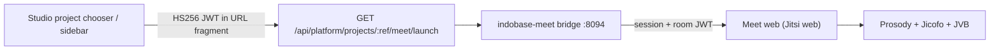

# Indobase Meet — video meetings for org / project

Indobase Meet (`indobase-meet/`) is the first-class video product for every organization and project. The media engine is self-hosted Jitsi (official Docker images); customer-facing branding is **Meet** / **Indobase Meet** only — never name the engine in UI. See [INDOBASE-ECOSYSTEM-NAMING.md](./INDOBASE-ECOSYSTEM-NAMING.md).

| Host (prod) | Host (staging) |
|---|---|
| `meet.indobase.in` | `meet.indobase.fun` |

## Customer naming

| Use | Name |
|---|---|
| Product (chooser, launch, titles) | **Meet** |
| Full product chrome | Indobase Meet |
| Never in UI | Jitsi, Jitsi Meet, 8x8, “Powered by …” |

Control plane: Vyom **103.190.92.249** (same pattern as Discuss / Workspace).

---

## Architecture (Phase 1)



| Layer | Role |
|---|---|
| **Studio** | Mints `aud=indobase-meet` handoff JWT; org role gate (owner/admin/developer/viewer) |
| **Bridge** | `/sso/launch` fragment exchange, session cookie, mint engine room JWT, brand HTML proxy, `/meeting/{id}` |
| **Engine** | Official `jitsi/web|prosody|jicofo|jvb` images — not vendored; invisible to customers |

Studio session SSO only. Bridge redirects native engine auth/register/password routes to Studio sign-in.

---

## Org / project → Meet space mapping

| Indobase | Meet | Stable key |
|---|---|---|
| Organization slug | Org / team equivalent | `ib-meet-org-{sanitized_org_slug}` |
| Project ref | Default meeting space (room id) | `ib-meet-proj-{sanitized_project_ref}` |

Implementation (must stay in sync):

- `indobase-meet/bridge/src/space-map.ts`
- `apps/studio/lib/api/saas/meet-launch-shared.ts`

Deep link after SSO: `/meeting/{meetingId}`.

### Role mapping

| Studio org role | Meet role | Engine privileges |
|---|---|---|
| owner | Admin | moderator |
| admin | Moderator | moderator |
| developer | Participant | participant |
| viewer | Viewer | participant (view-oriented) |

---

## SSO contract

Same shape as other ecosystem products (`product-handoff.ts`):

| Claim | Value |
|---|---|
| `aud` | `indobase-meet` |
| `iss` | Studio origin |
| `sub` | GoTrue user id |
| `email` | Primary email |
| `organization_slug` | SaaS org slug |
| `project_ref` | Project ref |
| `project_name` | Display name |
| `role` | owner \| admin \| developer \| viewer |
| `exp` | ~5 minutes |

**Secrets:** `MEET_HANDOFF_SECRET` on Meet + `STUDIO_HANDOFF_SECRET` (or `MEET_HANDOFF_SECRET`) on Studio — minimum 32 chars. Never fall back to `AUTH_JWT_SECRET`.

**Launch URL**

```
https://meet.indobase.in/sso/launch?project_ref={ref}&from=studio#token={jwt}
```

Flow:

1. Browser loads `/sso/launch` (token in fragment).
2. Bridge `POST /sso/session` verifies HS256 JWT (`aud=indobase-meet`).
3. Bridge sets `indobase_meet_session`, maps org/project → meeting id, mints engine room JWT.
4. Redirects to `/meeting/{meetingId}` (branded shell → engine with Indobase chrome).

`/sso/health` returns `{ ok, service, audience, version, handoffConfigured, upstreamReady }` — no internal hostnames.

---

## Workspace Meetings module

Workspace rail **Meetings** does **not** embed a raw engine iframe. It SSO-launches Indobase Meet (same `aud=indobase-meet` contract), either via Studio `…/meet/launch` or a Workspace bridge mint when `MEET_HANDOFF_SECRET` is shared. Invite URLs always point at `meet.*/meeting/{id}`.

Calendar stays a separate Workspace module (`calendar.ts` / `docker-compose.calendar.yml`) — untouched by Meet.

---

## Branding (Phase 1)

- Bridge HTML proxy (text/html): rewrite title, favicon, APP_NAME / watermarks via config overwrite + CSS/JS injection.
- Brand assets under `/brand/*` from `packages/common/assets/brand/`.
- Studio brand blue ≈ `#3B8FD6`.
- Kill “Powered by” / engine watermarks where CE env + interfaceConfig allow.

Honest CE limits: compiled engine JS may still contain residual upstream strings we cannot erase without forking the webapp. Phase 1 covers chrome we control.

---

## Event bus (Phase 2)

`POST /api/events` accepts analytics / automation envelopes.

| Type | Behavior |
|---|---|
| `meet.joined` (and other) | Accepted, deferred (no durable store yet) |
| `calendar.meet.linked` / `discuss.call.started` / `meet.room.linked` | In-memory room registry via `acceptRoomLinkEvent` |

`POST /api/rooms/link` accepts a short Meet handoff JWT from Calendar / Discuss bridges and registers the room without a browser session cookie.

`GET /api/rooms/:meetingId` (session) returns invite path + any linked metadata.

---

## Deploy notes (Vyom `.249`)

1. **DNS:** `meet.indobase.in` + `meet.indobase.fun` A → `103.190.92.249`.
2. **Firewall:** allow **UDP 10000** (JVB media) to the host; set `JVB_ADVERTISE_IPS` to the public IPv4.
3. **Secrets (≥32):** `MEET_HANDOFF_SECRET` (= Studio `MEET_HANDOFF_SECRET` or shared `STUDIO_HANDOFF_SECRET`), `JWT_APP_ID` / `JWT_APP_SECRET` (Prosody + bridge), XMPP service passwords (`./gen-meet-passwords.sh`).
4. **Compose:** `/opt/indobase-meet` from `indobase-meet/docker/deploy/` — Traefik → bridge `:8094`; bridge proxies engine web.
5. **Smoke:** `curl -sS https://meet.indobase.in/sso/health` → `handoffConfigured: true`; Studio → Open Meet → room loads without engine chrome in titles we control.

Staging-first for Studio/Builder control-plane; Meet host follows the same `.fun` / `.in` pair as Discuss.

---

## Phase 2 status

| Area | Status |
|---|---|
| Calendar sync | **Shipped** — Calendar `/api/meet` + `/api/meet/attach` mint stable `ib-meet-proj-*` / `ib-meet-evt-*` rooms + SSO launch; Meet `/api/rooms/link` |
| Discuss start-call | **Shipped** — channel header **Start call** → `/api/meet/start` → Meet SSO (`ib-meet-ch-*`) |
| Drive / Files recordings | Documented — not built |
| AI summary | Documented — not built |
| Analytics | Documented — join events accepted, no Analytics sink yet |
| Notifications / reminders | **Stub only** — see Phase 2C note below |
| Search | Documented — not built |
| Automation / event bus | Partial — room-link types register in-memory |

### Phase 2C — reminders (stub)

Lightweight pre-meeting reminders (Discuss DM / email / Studio bell) are **not** implemented. Calendar and Meet accept event envelopes so a future worker can subscribe; until then operators should treat reminders as out of scope.

**Explicitly out of Phase 2:** live transcription, AI Q&A, CRM auto-update, full React redesign of the engine webapp, Universal Search indexing, Google/Outlook sync.

---

## Related docs

- [INDOBASE-ECOSYSTEM-NAMING.md](./INDOBASE-ECOSYSTEM-NAMING.md)
- [INDOBASE-DISCUSS.md](./INDOBASE-DISCUSS.md) (SSO / bridge template)
- [INDOBASE-CALENDAR.md](./INDOBASE-CALENDAR.md)
- [INDOBASE-SUITE.md](./INDOBASE-SUITE.md) (Workspace Meetings → Meet launch)
- `indobase-meet/NOTICE.md` (AGPL attribution)
