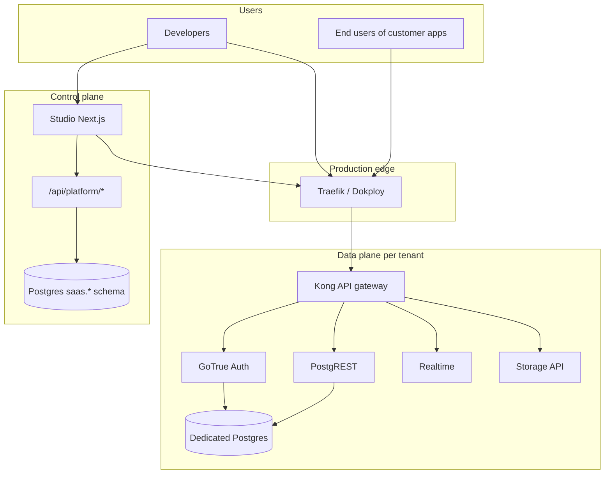
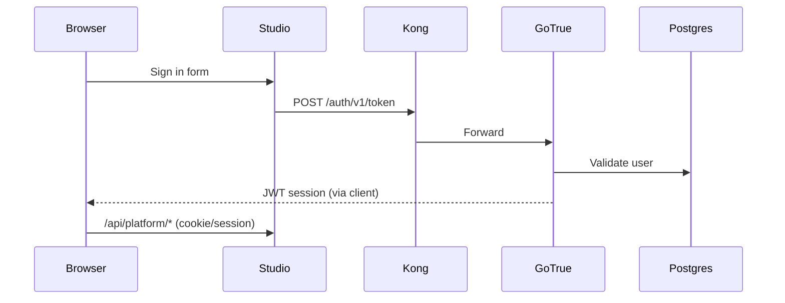

# Indobase — Engineering & Design Team Handbook

> **Purpose:** Single reference for onboarding engineering and design teams to the Indobase monorepo, product surfaces, architecture, design system, and production operations.  
> **Repo:** [Indobase/Indobase](https://github.com/Indobase/Indobase) · **Branch:** `main`  
> **Last updated:** June 2026

---

## Table of contents

1. [Product overview](#1-product-overview)
2. [Monorepo map](#2-monorepo-map)
3. [Architecture](#3-architecture)
4. [Applications & tech stack](#4-applications--tech-stack)
5. [Design system & UI](#5-design-system--ui)
6. [User journeys & key screens](#6-user-journeys--key-screens)
7. [Authentication & API surface](#7-authentication--api-surface)
8. [Billing & compliance](#8-billing--compliance)
9. [Packages & client SDKs](#9-packages--client-sdks)
10. [Local development](#10-local-development)
11. [Testing](#11-testing)
12. [CI/CD & production](#12-cicd--production)
13. [Branding & naming rules](#13-branding--naming-rules)
14. [Conventions for contributors](#14-conventions-for-contributors)
15. [Related documentation index](#15-related-documentation-index)

---

## 1. Product overview

**Indobase** is a managed **Postgres BaaS** (database, Auth, REST, Realtime, Storage, Edge Functions) with a multi-tenant **SaaS control plane**: organizations, teams, projects, usage, and billing.

**Target experience:** Firebase-shaped developer UX on enterprise open-source data-plane services (Postgres, Kong, GoTrue, PostgREST, Realtime, Storage).

**Production surfaces:**

| Surface | URL | What it is |
|---------|-----|------------|
| Studio (dashboard) | `https://studio.indobase.in` | Org/project management, SQL editor, Auth/Storage/Realtime UIs |
| Control-plane API | `https://api.indobase.in` | Kong gateway → GoTrue, PostgREST, Storage, Realtime |
| Marketing | `https://indobase.in` | Pricing, privacy, DPDP, contact (SvelteKit `apps/www`) |
| Per-tenant API | `https://{project-ref}.indobase.in` | Dedicated data-plane stack per project |
| Docs | `https://indobase.in/docs` | Product documentation (`apps/docs`) |

**Core SaaS flow:** Sign up → confirm email → sign in → select plan → create organization → create project → connect app (Connect UI).

---

## 2. Monorepo map

**Tooling:** pnpm workspaces + Turborepo · Node ≥ 22 · pnpm 10.24

```
ind-repo/
├── apps/                    # User-facing applications
│   ├── studio/              # Main SaaS dashboard (Next.js)
│   ├── www/                 # Marketing site (SvelteKit)
│   ├── docs/                # Documentation site (Next.js)
│   ├── design-system/       # Design system docs app
│   ├── ui-library/          # shadcn-style component registry
│   ├── learn/               # Learning content
│   └── studio-desktop/      # Desktop variant
├── packages/                # Shared libraries
│   ├── ui/                  # Design tokens + Radix primitives
│   ├── ui-patterns/         # Composed layout patterns
│   ├── icons/               # Icon set
│   ├── common/              # Shared hooks, auth, constants
│   ├── api-types/           # OpenAPI-generated types
│   ├── marketing/           # Reusable marketing sections
│   └── indobase-*/          # SDK forks (source only; see §9)
├── docker/                  # Data-plane Compose, provisioner, deploy docs
├── docs/                    # Repo-level documentation (this file)
├── e2e/studio/              # Playwright E2E tests
├── supabase/                # Migrations, local CLI config
├── scripts/                 # Build, audit, env generation
├── examples/                # Sample apps (auth, realtime, edge functions)
└── .github/workflows/       # CI/CD
```

**Key commands (root `package.json`):**

| Command | Purpose |
|---------|---------|
| `pnpm dev:studio` | Studio dev server (port 8082) |
| `pnpm dev:www` | Marketing site |
| `pnpm dev:design-system` | Design system docs (port 3003) |
| `pnpm build:studio` | Production Studio build |
| `pnpm test:studio` | Studio unit tests (Vitest) |
| `pnpm e2e` | Playwright E2E against Studio |

---

## 3. Architecture

### 3.1 High-level diagram



### 3.2 Control plane vs data plane

| Layer | Responsibility | Key paths |
|-------|----------------|-----------|
| **Control plane** | Orgs, members, billing, project metadata, provisioning orchestration | `apps/studio/pages/api/platform/`, `apps/studio/lib/api/saas/` |
| **Control-plane DB** | `saas.*` schema (projects, orgs, subscriptions, audit) | `MULTITENANCY_RLS.md`, migrations under `supabase/` |
| **Data plane** | Per-project Postgres + Kong/GoTrue/REST/Realtime/Storage stack | `docker/docker-compose.yml`, `docker/tenants/`, `docker/provisioner/` |
| **Provisioner** | Writes tenant compose + Traefik config, runs `docker compose up` | `docker/provisioner/server.mjs` |

**Default:** New projects get a **dedicated tenant database** (`SAAS_DEDICATED_DATABASE_ON_PROJECT_CREATE`).

**Health gating:** Projects promote to `ACTIVE_HEALTHY` only when tenant REST + Auth are reachable (not merely when provisioning scripts finish).

### 3.3 URL wiring

See `WIRING.md` and `SINGLE_DOMAIN.md` for full env contracts.

| Environment | Studio | API | Notes |
|-------------|--------|-----|-------|
| Production | `studio.indobase.in` | `api.indobase.in` | Studio deployed via Docker Swarm; data plane via Compose |
| Local | `localhost:8082` | `localhost:8000` (Kong) | `pnpm dev:studio` + `docker compose up` |

Studio production image merges **marketing static assets** from `apps/www` into Studio `public/` so one container can serve dashboard routes and marketing paths (see root `Dockerfile`).

---

## 4. Applications & tech stack

### 4.1 Studio (`apps/studio/`)

**Role:** Primary SaaS product — dashboard, platform APIs, project editors.

| Area | Technology |
|------|------------|
| Framework | Next.js ~16 (Pages router + API routes) |
| UI | React 18.3, TanStack Query, Radix via `packages/ui` |
| Styling | Tailwind 3.4, CSS variables from design tokens |
| Auth client | GoTrue via `@indobaseinc/indobase-js` / `indobase-js` workspace shim |
| Tests | Vitest 3.2, Testing Library, Playwright (e2e) |

**Important directories:**

| Path | Contents |
|------|----------|
| `pages/` | Routes: `sign-in`, `organizations`, `project/[ref]/*`, `org/[slug]/*` |
| `pages/api/platform/` | Control-plane REST APIs |
| `components/layouts/` | Page shells (ProjectLayout, SQLEditorLayout, …) |
| `components/interfaces/` | Feature UI (Connect, Storage, Auth, Home, …) |
| `components/ui/` | Studio-local reusable components (not the `ui` package) |
| `lib/api/saas/` | Server-side SaaS logic (`platform.ts`, billing, provisioning) |
| `data/` | TanStack Query hooks and fetchers |

### 4.2 Marketing (`apps/www/`)

**Role:** Public marketing site — home, pricing, privacy, terms, DPDP, contact.

| Area | Technology |
|------|------------|
| Framework | SvelteKit 2, Svelte 5, Vite 7 |
| UI | Melt UI, bits-ui, Threlte (3D) |
| Styling | Tailwind 4 |
| Tests | Vitest + Playwright |

**Routes:** `apps/www/src/routes/` — `(marketing)/`, `pricing/`, `privacy/`, `terms/`, `dpdp/`, `contact-us/`.

### 4.3 Other apps

| App | Path | Stack | Purpose |
|-----|------|-------|---------|
| Docs | `apps/docs/` | Next.js 15 | Product documentation |
| Design system | `apps/design-system/` | Next.js 15 + Contentlayer | Component/token documentation |
| UI library | `apps/ui-library/` | Next.js 15 | shadcn-style registry browser |

### 4.4 Data-plane services (`docker/docker-compose.yml`)

| Service | Image / role |
|---------|----------------|
| `db` | Supabase Postgres 15 |
| `kong` | API gateway (routes `/auth/v1`, `/rest/v1`, `/storage/v1`, `/realtime/v1`) |
| `auth` | GoTrue |
| `rest` | PostgREST |
| `realtime` | Supabase Realtime |
| `storage` + `imgproxy` | File storage |
| `meta` | postgres-meta (schema introspection) |
| `functions` | Edge Functions (Deno runtime) |
| `analytics` + `vector` | Log pipeline |
| `supavisor` | Connection pooler |
| `data-plane-provisioner` | Per-tenant stack provisioning HTTP service |

---

## 5. Design system & UI

### 5.1 Package hierarchy

```
packages/ui/           → Tokens, Radix primitives, themes (foundation)
packages/ui-patterns/  → Composed patterns (PageHeader, CommandMenu, …)
packages/icons/        → Icon set
apps/studio/components/ui/     → Studio-specific reusables
apps/studio/components/interfaces/ → Feature screens (Connect, Storage, …)
apps/studio/components/layouts/  → Page shells
```

**Rule:** Do not put feature logic in `packages/ui`. Feature-coupled UI lives in `components/interfaces/`.

### 5.2 Design tokens (`packages/ui/`)

- Tokens originate from **Figma Tokens** → Style Dictionary → CSS variables
- Build output: `packages/ui/build/` (`css/`, `themes/`, `tw-extend/`)
- Commands: `pnpm build-styles` (see `packages/ui/README.md`)
- Theming: `next-themes` + CSS variables; dark/light supported

**Design team workflow:**

1. Update tokens in Figma / token JSON
2. Run token build pipeline in `packages/ui`
3. Verify in `apps/design-system` (port 3003: `pnpm dev:design-system`)
4. Studio consumes variables via Tailwind + `@ui` imports

### 5.3 UI patterns (`packages/ui-patterns/`)

Composed, product-agnostic patterns — import by subpath (no barrel file):

- `PageContainer`, `PageHeader`, `PageSection`
- `CommandMenu`, `FilterBar`, `FormLayout2`
- `GlassPanel`, `McpUrlBuilder`, `InnerSideMenu`

### 5.4 Studio component placement

From `apps/studio/components/README.md`:

| Folder | Use when |
|--------|----------|
| `layouts/` | Page structure shared across a section |
| `interfaces/` | Tightly coupled to a product feature |
| `ui/` | Reusable within Studio only |

**React patterns:** Prefer compound components over boolean prop proliferation. See `.claude/skills/vercel-composition-patterns/`.

### 5.5 Connect UI (design + engineering touchpoint)

**Path:** `apps/studio/components/interfaces/Connect/`

High-visibility surface for developers connecting apps to a project:

- Tabs: frameworks, ORMs, MCP, connection strings
- Entry: header “Connect” button, query params `showConnect`, `connectTab`
- Related: `ConnectSheet/`, `ProjectConnectionHoverCard.tsx`, `data/api-keys/api-keys-query.ts`

**Design notes:** Must show publishable/anon keys clearly; legacy projects use JWT anon keys until publishable keys are created in Studio.

### 5.6 Marketing design (`apps/www/`)

| Area | Path |
|------|------|
| Routes | `src/routes/` |
| Partials / sections | `src/partials/`, `src/lib/` |
| Styles | `src/scss/` |
| Shared React marketing blocks | `packages/marketing/` |

**Brand:** Indobase naming and visuals only — no Supabase logos or “fork of Supabase” language in shipped UI (see §13).

---

## 6. User journeys & key screens

### 6.1 Authentication

| Step | Route / API |
|------|-------------|
| Sign up | `pages/sign-up.tsx` → `/api/platform/signup` |
| Email confirm | `pages/auth/confirm.tsx` |
| Sign in | `pages/sign-in.tsx` → GoTrue `signInWithPassword` |
| MFA | `pages/sign-in-mfa.tsx` |
| SSO | `pages/sign-in-sso.tsx` |
| Forgot / reset password | `forgot-password.tsx`, `reset-password.tsx` |

**Client auth:** `lib/gotrue.ts`, `packages/common/auth.tsx`  
**Server auth config (per project):** `lib/api/saas/gotrue-config.ts`

### 6.2 Organization & billing

| Screen | Path |
|--------|------|
| Org picker | `pages/organizations.tsx` |
| Org settings | `pages/org/[slug]/general.tsx`, `team.tsx`, `security.tsx`, `sso.tsx` |
| Billing | `pages/org/[slug]/billing.tsx`, `pages/billing/plans.tsx` |
| Usage | `pages/org/[slug]/usage.tsx` |

### 6.3 Project workspace

| Area | Path under `pages/project/[ref]/` |
|------|-------------------------------------|
| Home / backend | `backend.tsx`, `index.tsx` |
| Database | `database/`, `editor/`, `sql/` |
| Auth | `auth/` (users, providers, policies, hooks) |
| Storage | `storage/` |
| Edge Functions | `functions/` |
| Realtime | `realtime/` |
| Settings | `settings/` (API keys, JWT, custom domains, …) |
| Logs / observability | `logs/`, `observability/` |

### 6.4 New project

`pages/new/[slug].tsx` — wizard after org creation; triggers dedicated DB + data-plane provisioning.

---

## 7. Authentication & API surface

### 7.1 Stack



| Component | Production URL / config |
|-----------|-------------------------|
| GoTrue | `https://api.indobase.in/auth/v1` |
| Kong | Routes auth, rest, storage, realtime |
| Studio env | `NEXT_PUBLIC_GOTRUE_URL`, `NEXT_PUBLIC_ANON_KEY` |
| Per-project JWT | `lib/api/saas/project-jwt.ts` |

### 7.2 Platform APIs

Base: `/api/platform/` (same origin as Studio in production).

Examples:

- `GET /api/platform/organizations`
- `POST /api/platform/projects`
- `GET /api/platform/projects/[ref]/api-keys`
- `GET/PUT` auth config for project
- `POST /api/platform/razorpay/webhook`

Types: `packages/api-types/` (OpenAPI codegen).

### 7.3 CORS

`api.indobase.in` allows `https://studio.indobase.in` (Traefik middleware). See `CORS_ARCHITECTURE.md`, `docker/traefik/indobase-backend-kong.yml`.

---

## 8. Billing & compliance

### 8.1 Billing (Razorpay, INR)

| Topic | Detail |
|-------|--------|
| Provider | Razorpay (production default) |
| UI flag | `NEXT_PUBLIC_RAZORPAY_BILLING=true` |
| Plans | Free, Pro, Team, Enterprise — `lib/api/saas/indobase-billing-plans.ts` |
| Webhook | `/api/platform/razorpay/webhook` |
| Setup doc | `RAZORPAY_BILLING_SETUP.md` |

Stripe UI paths exist but are disabled when Razorpay billing is enabled.

### 8.2 DPDP (India)

| Surface | Location |
|---------|----------|
| Marketing | `apps/www/src/routes/dpdp/`, `privacy/` |
| Sign-up consent | `SignUpForm.tsx`, `/api/platform/signup` |
| Data principal APIs | `lib/api/saas/data-principal.ts` (export, requests) |
| Constants | `packages/common/dpdp.ts` |

---

## 9. Packages & client SDKs

### 9.1 Published npm scope: `@indobaseinc/*`

Catalog versions in `pnpm-workspace.yaml`. Apps import:

```ts
import { createClient } from '@indobaseinc/indobase-js'
```

| Package | Role |
|---------|------|
| `@indobaseinc/indobase-js` | Main client |
| `@indobaseinc/auth-js` | Auth |
| `@indobaseinc/postgrest-js` | REST |
| `@indobaseinc/realtime-js` | Realtime |
| `@indobaseinc/storage-js` | Storage |
| `@indobaseinc/pg-meta` / `postgres-meta` | Schema management |
| `@indobaseinc/auth-ui-react` | Pre-built auth UI |

### 9.2 Workspace packages (monorepo)

Use `workspace:*` in `package.json`:

`ui`, `ui-patterns`, `common`, `config`, `icons`, `shared-data`, `api-types`, `marketing`, `ai-commands`, `eslint-config-indobase`

### 9.3 Local SDK forks

`packages/indobase-js/`, `indobase-auth-js/`, etc. are **source forks** excluded from workspace install (`!packages/indobase-js` in `pnpm-workspace.yaml`). Production consumes published `@indobaseinc/*` packages.

**Audit:** External bundles must not ship Supabase branding — `scripts/audit-no-supabase.sh`, `docs/AUDIT_REBRAND.md`.

---

## 10. Local development

### 10.1 Prerequisites

- Node ≥ 22, pnpm 10.24
- Docker (for data plane)
- Optional: Supabase CLI for local migrations

### 10.2 Quick start

```bash
pnpm install
pnpm dev:studio          # Studio at http://localhost:8082
pnpm dev:www             # Marketing site
pnpm dev:design-system   # Design tokens/components at :3003
```

### 10.3 Full stack (data plane)

```bash
cd docker
cp .env.example .env     # Configure secrets, URLs
docker compose up -d
```

See `DEVELOPERS.md`, `docker/README.md`.

### 10.4 SaaS mode

Studio SaaS features require `NEXT_PUBLIC_INDOBASE_SAAS=true` and control-plane Postgres with `saas.*` schema. Gate: `IS_SAAS` in `packages/common`.

### 10.5 Environment variables (production build)

Set in `.github/workflows/docker-publish.yml` and Dokploy/Swarm:

- `NEXT_PUBLIC_SITE_URL`, `NEXT_PUBLIC_API_URL`, `NEXT_PUBLIC_GOTRUE_URL`
- `NEXT_PUBLIC_ANON_KEY`
- `NEXT_PUBLIC_RAZORPAY_BILLING`, `NEXT_PUBLIC_RAZORPAY_KEY_ID`

Server secrets (not in client bundle): `DATA_PLANE_PROVISIONER_URL`, `DATA_PLANE_PROVISIONER_TOKEN`, `DATABASE_URL`, Razorpay secrets — see `docker/DOKPLOY-STUDIO-ENV.md`.

---

## 11. Testing

### 11.1 Pyramid

| Layer | Tool | Location |
|-------|------|----------|
| Unit / lib | Vitest | `apps/studio/lib/**/*.test.ts`, `packages/ui`, `packages/ui-patterns` |
| Component | Vitest + Testing Library | Colocated with components |
| E2E | Playwright | `e2e/studio/` |
| www | Playwright | `apps/www` integration tests |

### 11.2 Commands

```bash
pnpm test:studio
pnpm test:ui
pnpm test:ui-patterns
pnpm e2e                    # Requires e2e:setup:saas or running stack
```

### 11.3 Guidance

- Prefer extracting pure functions from components for unit tests
- E2E for critical journeys: sign-in, org creation, project connect
- Skills: `.claude/skills/studio-testing/SKILL.md`, `.agents/skills/vitest/SKILL.md`

### 11.4 CI workflows

| Workflow | Purpose |
|----------|---------|
| `studio-unit-tests.yml` | Vitest |
| `studio-e2e-test.yml` | Playwright |
| `studio-lint-ratchet.yml` | ESLint ratchet |
| `ui-tests.yml`, `ui-patterns-tests.yml` | Design system packages |
| `docker-publish.yml` | Production image build + push |

---

## 12. CI/CD & production

### 12.1 Build pipeline

```
git push main
  → GitHub Actions (docker-publish.yml)
  → Docker Hub: roshanraghavander/ind-repo:<git-sha>
  → VPS Docker Swarm: indobase-studio-erpgp1
  → Verify: GET https://studio.indobase.in/api/health/live → version == SHA
```

**Image contents:** `apps/www` static build merged into Studio `public/`; single Node server on port 8080.

**Prefer SHA tags** over `:latest` for rollouts.

### 12.2 Production topology

| Component | Deployment |
|-----------|------------|
| Studio | Docker Swarm on VPS (`187.77.30.165`), separate from Compose backend |
| Control-plane data plane | Docker Compose (`indobase-backend-bmqhan`) — Kong, GoTrue, Postgres, … |
| Tenant stacks | Per-project compose under `docker/tenants/`, Traefik dynamic routes |
| Edge | Dokploy Traefik — must share network with Kong for `api.indobase.in` |
| Provisioner | `docker/provisioner/` — HTTP API for tenant stack lifecycle |
| Fleet repair | `docker/scripts/tenant-fleet-health-repair.sh` (cron-friendly) |
| Project deployment executor | VPS worker `docker/scripts/project-deployment-executor.sh` via `indobase-project-deployment-executor.service` |

### 12.3 Operational runbooks

| Doc | Topic |
|-----|-------|
| `docker/DOKPLOY-STUDIO-DEPLOY.md` | Studio Swarm rollout |
| `docker/DOKPLOY-STUDIO-ENV.md` | Studio env secrets |
| `docker/DOKPLOY-DATA-PLANE.md` | Compose backend |
| `docker/scripts/install-project-deployment-executor.sh` | VPS worker install for project deployment queue |
| `docker/docs/TENANT_DATA_PLANE_TUNING.md` | Tenant resource limits |
| `PRODUCTION_READINESS.md` | Launch checklist |

### 12.4 Health checks

| Endpoint | Expected |
|----------|----------|
| `https://studio.indobase.in/api/health/live` | `{ "status": "ok", "version": "<git-sha>" }` |
| `https://api.indobase.in/auth/v1/health` | GoTrue version JSON |

---

## 13. Branding & naming rules

**Product name:** Indobase (not Supabase in user-facing copy).

| Rule | Detail |
|------|--------|
| UI / docs | Indobase branding, logos, terminology |
| Shipped bundles | Zero Supabase naming in audit bundle (`scripts/audit-no-supabase.sh`) |
| npm | Publish as `@indobaseinc/*`; workspace shims during migration |
| Code comments | Upstream references OK in internal/dev paths; not in customer-facing strings |

Full tracker: `docs/AUDIT_REBRAND.md`.

---

## 14. Conventions for contributors

### 14.1 Git

- Default branch: `main`
- Commit only when asked; push to `origin main` when shipping
- Do not force-push `main`

### 14.2 Code style

- TypeScript strict mode
- Prettier on save (`pnpm format`)
- ESLint; Studio uses ratchet for selected rules
- Match surrounding patterns; minimal scope per PR

### 14.3 Studio server patterns

- Platform logic: `lib/api/saas/platform.ts` (monolith for provisioning/billing/orgs)
- API routes: thin wrappers in `pages/api/platform/`
- Use `ensureSaasTables()` before DB mutations
- Tenant provisioning: `tenant-data-plane-provision.ts`, compose validation in `tenant-compose-validation.ts`

### 14.4 Agent / team memory

- `AGENTS.md` — learned preferences and production facts
- `.cursor/rules/` — deploy flows, Studio hooks

---

## 15. Related documentation index

| Document | Audience | Topic |
|----------|----------|-------|
| `README.md` | All | Product overview |
| `DEVELOPERS.md` | Engineering | Local dev, Turborepo |
| `WIRING.md` | Engineering | URL and env contract |
| `MULTITENANCY_RLS.md` | Engineering | `saas.*` RLS |
| `PRODUCTION_READINESS.md` | Eng / Ops | Launch checklist |
| `docs/STUDIO_ROADMAP.md` | Product / Eng | Priorities |
| `docs/AUDIT_REBRAND.md` | Eng / Design | Naming compliance |
| `RAZORPAY_BILLING_SETUP.md` | Engineering | Billing integration |
| `CORS_ARCHITECTURE.md` | Engineering | API CORS |
| `docker/README.md` | Ops | Data-plane stack |
| `apps/studio/components/README.md` | Eng / Design | Component placement |
| `packages/ui/README.md` | Design | Token pipeline |
| `packages/ui-patterns/README.md` | Design | Pattern imports |
| `e2e/studio/README.md` | QA / Eng | E2E setup |

---

## Appendix A — Design team quick reference

| Need | Go to |
|------|-------|
| Tokens & themes | `packages/ui/`, Figma → build pipeline |
| Live component gallery | `pnpm dev:design-system` → localhost:3003 |
| Studio screen patterns | `components/interfaces/`, `components/layouts/` |
| Marketing pages | `apps/www/src/routes/` |
| Icons | `packages/icons/` |
| Typography / color in prod | `packages/ui/build/css/` |
| Connect modal UX | `components/interfaces/Connect/` |
| Auth screens | `components/interfaces/SignIn/` |

---

## Appendix B — Engineering team quick reference

| Need | Go to |
|------|-------|
| Add platform API | `pages/api/platform/` + `lib/api/saas/` |
| Project provisioning | `platform.ts`, `tenant-data-plane-provision.ts` |
| Auth settings API | `gotrue-config.ts` |
| API types | `packages/api-types/`, run `pnpm api:codegen` |
| Docker services | `docker/docker-compose.yml` |
| Tenant provisioner API | `docker/provisioner/server.mjs` |
| Deploy Studio | `docker/DOKPLOY-STUDIO-DEPLOY.md`, Swarm on VPS |
| Debug tenant health | `tenant-data-plane-health.ts`, fleet repair script |
| Feature flag SaaS | `IS_SAAS` / `NEXT_PUBLIC_INDOBASE_SAAS` |

---

## Appendix C — Glossary

| Term | Meaning |
|------|---------|
| **Control plane** | Indobase SaaS layer (orgs, billing, project metadata) |
| **Data plane** | Per-project Postgres + Kong/GoTrue/REST/Realtime/Storage |
| **Project ref** | Short unique ID for a project (used in URLs and tenant hostnames) |
| **Tenant stack** | Docker Compose stack for one project's data plane |
| **Provisioner** | Service that creates/updates tenant stacks on the host |
| **Studio** | Web dashboard (`apps/studio`) |
| **GoTrue** | Auth API (JWT, email, OAuth) |
| **Kong** | API gateway in front of data-plane services |
| **ACTIVE_HEALTHY** | Project status when data plane is verified reachable |

---

*This handbook summarizes the repository as of June 2026. For details on any section, follow the linked paths and dedicated docs above.*
