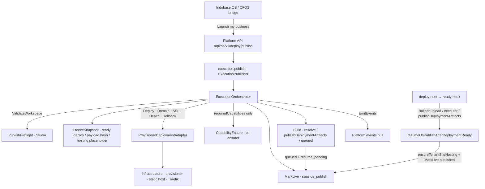

# ADR 0003: execution.publish pipeline

**Status:** Accepted (post–PR 3 — Build queued auto-resume)  
**Date:** 2026-08-07  

Canonical specs: [../EXECUTION.md](../EXECUTION.md) · [../INDOBASE-OS.md](../INDOBASE-OS.md) · [../PLATFORM.md](../PLATFORM.md) · [../EVENTS.md](../EVENTS.md)

---

## Context

Customers launch businesses with one sentence — **“Launch my business.”** — which maps to `execution.publish`. Today publish is scattered across Builder upload, Studio `publishDeploymentArtifacts`, provisioner `publish-site`, and static site routes. The kernel needs a single publish pipeline contract so Indobase OS, Platform API, and future Ensurer steps share one language without leaking Docker/Swarm paths.

---

## Decision

Introduce an **execution.publish pipeline** in `@indobase/platform` (`packages/platform/src/execution/`):

| Module | Role |
|--------|------|
| `DeploymentResult` | Typed success/failure outcomes (`liveUrl`, stage, error codes) |
| `DeploymentAdapter` | Infrastructure port — `prepare`, `deploy`, `assignDomain`, `provisionTLS`, `healthCheck`, `rollback` |
| `PublishPreflight` | Workspace/auth preflight port — Studio implements `validateWorkspace` |
| `PublishPorts` | Ports — `FreezeSnapshot`, `Build`, `CapabilityEnsure`, `MarkLive` |
| `ExecutionPipeline` | Ordered stage enum + `EXECUTION_PUBLISH_PIPELINE` |
| `ExecutionOrchestrator` | Walks stages; accepts adapter + optional Studio ports + event bus |
| `ExecutionPublisher` | Public `execution.publish()` entry delegating to orchestrator |

**Pipeline stages (in order):**

1. **ValidateWorkspace** — workspace/snapshot preflight  
2. **FreezeSnapshot** — durable immutable publish reference (never live editor state)  
3. **Build** — resolve ready artifact, publish payload files via existing Studio path, or return structured `queued`  
4. **CapabilityEnsure** — Ensurer only for `requiredCapabilities` (default empty = hosting-only)  
5. **Deploy** — ship via adapter (`ensureTenantSiteHosting`)  
6. **AssignDomain** — subdomain or custom domain  
7. **SSL** — TLS provision (Traefik wildcard stub)  
8. **HealthCheck** — live URL HEAD/GET probe; failure triggers rollback  
9. **MarkLive** — durable `os_publish` on `saas.projects.auth_config` (+ deployment metadata)  
10. **EmitEvents** — `DeploymentPublished` + `ExecutionFinished` on in-process event bus  

---

## Architecture



Provisioner HTTP routes remain **transport**; stage names are the OS language ([EXECUTION.md](../EXECUTION.md)).

---

## Three-PR rollout

| PR | Scope | Behavior |
|----|--------|----------|
| **PR 1** | Interfaces + skeleton | Types, adapter interface, orchestrator/publisher stubs; **no production wiring** |
| **PR 2** | Wire existing flow | `ProvisionerDeploymentAdapter` wraps `ensureTenantSiteHosting`; Studio `os-deploy.ts` calls `ExecutionPublisher.publish()` |
| **PR 3** | Hardening | Snapshot freeze, Ensurer integration, rollback, domain events, MarkLive durable record, real health probe |
| **Post–PR 3** | Freeze / Build gaps | Prefer immutable ready artifacts; content-addressed payload freeze; wrap `publishDeploymentArtifacts`; structured Build `queued` |
| **This update** | Queued auto-resume | Queue building deploy for sources/drafts; stamp `resume_pending`; resume MarkLive + hosting on `ready` |

### FreezeSnapshot (current)

Preference order:

1. Explicit `deploymentId` when **ready** → freeze `deploy_<id>` + `content_hash` / hosting_artifacts fingerprint  
2. Latest **ready** deployment with `hosting_artifacts` (immutable published files), else any ready  
3. Payload `artifacts` / `files` map → content-addressed `sha256:…` freeze (`source: payload_artifacts`) — **not** live editor state  
4. Static `sourceFiles` (index.html, no package build script) → same content-addressed freeze  
5. Buildable `sourceFiles` / known Builder draft → hosting-only placeholder; Build queues  
6. Else **hosting-only placeholder** (`source: hosting_placeholder`) — Launch still reserves hosting (PR 2 UX)  

In-progress (`requested` / `building`) explicit ids freeze as hosting-only with `source: in_progress_deployment` so Build can queue.

### Build (current)

| Input | Behavior |
|-------|----------|
| Ready frozen deployment | Resolve `artifactRef` / `buildId` only |
| Payload artifact files | `createProjectDeployment` + **`publishDeploymentArtifacts`** (existing Studio path); promote freeze to ready artifact |
| Static `sourceFiles` | Same inline `publishDeploymentArtifacts` path |
| Buildable `sourceFiles` / Builder draft | Create deployment → `building` + `os_publish_resume.pending`; structured **`queued`** |
| Active `requested`/`building` deploy, no ready artifact | Structured **`queued`** — customer message, URL reserved |
| Hosting-only, no build inputs | Pass-through (hosting-only Launch still works) |
| Force-build flags without inputs | Customer-safe failure: finish building, then Launch again |

Builder Remix **server-build** is not invoked synchronously from the Studio control-plane request (wrong process / too heavy). Buildable sources leave a `building` deployment; Classic/Gen3 Builder completes via existing `/deployments/builder` + `publishDeploymentArtifacts`. Static sources publish in-request.

### Auto-resume after Build queued

Sequence:

```text
Launch → Build queued → MarkLive(publish_status=queued, resume_pending=true, URL reserved)
  → Builder / publishDeploymentArtifacts / executor sets deployment status=ready
  → updateProjectDeployment hook → resumeOsPublishAfterDeploymentReady
  → ensureTenantSiteHosting + MarkLive(publish_status=published)
```

Hook lives in `updateProjectDeployment` (covers artifact finalize + deployment executor). No separate cron required for the ready→live transition when Launch stamped `resume_pending`.

### PR 3 + follow-up notes

- **Platform:** `PublishPorts` (`BuildArtifactResult` supports `queued` + `promoteSnapshot`); orchestrator stamps `deploymentId` on queued freeze; skips Deploy/Health when build-queued; customer-safe error sanitization; rollback after deploy/health failure  
- **Studio:** `os-publish-ports.ts` (freeze preference, payload/source hash, artifact publish wrap, ensure/markLive); `os-publish-resume.ts` (ready→MarkLive)  
- **API contract unchanged:** `/api/os/v1/deploy/publish` still returns `{ ok, url, status, message }` — success message: “Your business is now live”  
- **Optional body:** `required_capabilities` / `requiredCapabilities`; optional `artifacts` / `sourceFiles` / draft ids; empty capabilities = no auth/db on Launch  

---

## Consequences

- Hosting-only Launch path remains intact when no ready artifact and no payload/source files.  
- Freeze never copies mutable live editor / workspace trees — only durable deployment rows or content-addressed payload/source maps.  
- Build can finish a real site publish when files are supplied; otherwise queues with auto-resume on ready.  
- Rollback cannot unpublish site hosting (no provisioner API) — marks deployment metadata when a deployment id is known.  
- Coolify/K8s and customer-facing infra dashboards remain out of scope.

---

## Gaps / migration path (remaining)

| Gap | Current | Future |
|-----|---------|--------|
| Full workspace FreezeSnapshot | Ready deploy / payload/source file hash / hosting placeholder | Builder gen3 snapshot id + content-addressed workspace tree |
| Builder server-build from Studio | Not invoked in-request; buildable sources → `building` deploy; Builder posts artifacts | Optional Studio→Builder internal server-build job after CFOS build step |
| Auto-resume after Build queued | **Done** via `updateProjectDeployment` → `resumeOsPublishAfterDeploymentReady` | Optional notify / Discuss card on resume; retry/backoff if hosting ensure fails |
| Rollback | Metadata best-effort; no site unpublish | Provisioner unpublish / prior-route restore |
| HealthCheck policy | Probe for artifact publishes; hosting-only / build-queued skip | Retry/backoff; probe empty-site placeholders when desired |
| Post-launch Verify + AI Operator | **Phase stubs** — Studio `os-launch-verify` + `os-ai-operator` via `business.launch` Verify / StartOperator ports (best-effort after Publish); queued resume hooks Operate too | Hard gate MarkBusinessLive on verify; real operator workers (errors / conversions / SEO / support) |
| Custom domain / TLS | Wildcard Traefik stubs | Real AssignDomain / SSL adapters |
| Event consumers | In-process bus only | Mirror selected events to product analytics / Discuss |

---

## Non-goals

- Replacing provisioner — only wrapping it via `DeploymentAdapter`  
- New event bus / storage systems / dedicated build microservices  
- Exposing Studio/Project/Tenant/Docker/Traefik in OS API responses  
- Provisioning auth/db on every Launch unless `requiredCapabilities` says so  
