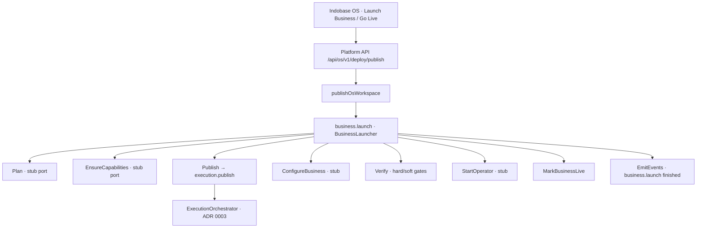

# ADR 0004: business.launch wraps execution.publish

**Status:** Accepted (PR 1 + PR 2 + Operate hard-verify)  
**Date:** 2026-08-07  

Canonical specs: [../INDOBASE-OS.md](../INDOBASE-OS.md) · [../PLATFORM.md](../PLATFORM.md) · [0003-execution-pipeline.md](./0003-execution-pipeline.md)

---

## Context

Customers say **“Launch my business”** / press **Launch Business** / **Go Live**. ADR 0003 made `execution.publish` the deploy substrate, but the public OS verb must not be publish/deploy. Indobase OS needs a **business.launch** entry that speaks business-live language while reusing the existing publish pipeline.

---

## Decision

Introduce **`business.launch()`** in `@indobase/platform` (`packages/platform/src/business/`):

| Module | Role |
|--------|------|
| `BusinessLaunchResult` | Customer-safe outcome (`liveUrl`, `live`/`queued`/`failed`, business-live messages) |
| `BusinessLaunchPipeline` | Ordered stages: Plan → EnsureCapabilities → **Publish** → Configure → Verify → StartOperator → MarkBusinessLive → EmitEvents |
| `BusinessLaunchPorts` | Planner / EnsureCapabilities / Configure / Verify / Operator interfaces (noop stubs OK) |
| `BusinessLauncher` | Public `launch()` — Publish stage calls `executionPublisher.publish()` |

**Six-kernel note** (production narrative in [INDOBASE-OS.md](../INDOBASE-OS.md)):  
Identity · Workspace · Capability · Execution · **Business Runtime** · Agent.  
`business.launch` is the bridge from Execution → Business Runtime after Go Live — not an eighth PLATFORM.md ABI contract. Platform still keeps Documents / Commands / Events under the hood.

It composes:

- **Execution** — Publish stage delegates to `execution.publish` (ADR 0003)
- **Capability** — optional EnsureCapabilities before Publish
- **Business Runtime** — Configure / Verify / StartOperator ports (stubs in PR1+PR2; filled in Phase 2)
- **Events** — EmitEvents marks `kind: business.launch` after success (does not duplicate `DeploymentPublished`)

Studio Platform API and CFOS bridge keep calling `/api/os/v1/deploy/publish` with `{ ok, url, status, message }` — `live` maps to wire `published`.

---

## Architecture

---

## Verify hard vs soft gates

After Publish returns `publishStatus: published`, Verify runs before MarkBusinessLive / EmitEvents claim “business live”.

| Severity | Checks | Effect on Launch |
|----------|--------|------------------|
| **Hard** | Homepage unreachable when `strictVerify` is true (artifact publish) | `status: failed`, `errorCode: VERIFY_FAILED`, customer-safe message; Operator / MarkBusinessLive claim / success EmitEvents skipped |
| **Soft** | robots/sitemap missing or unhealthy, optional health paths, auth login deferred | Warnings only — Launch may still return `live` |

**`strictVerify` resolution** (Studio `resolveStrictVerify`):

1. Explicit `BusinessLaunchInput.strictVerify` / `payload.strictVerify`
2. Env `OS_LAUNCH_STRICT_VERIFY` (`true`/`false`)
3. `os_publish.kind === 'hosting-only'` → **false** (empty-site 404 must not break hosting-only Launch)
4. Else **true** (artifact publish)

Queued Publish still **skips** Configure / Verify / Operator until resume (unchanged).

### Rollback policy (post-publish)

`execution.publish` may already have deployed hosting and stamped MarkLive. Hard verify **does not tear down** site routes or hosting unless a dedicated rollback path already exists and is easy.

Preferred remediation:

1. Overlay `saas.projects.auth_config.os_publish.publish_status = verify_failed` (keep `live_url`)
2. Persist `auth_config.os_launch_verify` with hard failures + soft warnings
3. Return OS API `{ ok: false, status: failed, url?, message }` so the reserved URL remains visible when present

Queued resume (`os-publish-resume` → `runPostPublishOperateHook`) stays **best-effort**: hard verify stamps `verify_failed` but never throws into the ready→MarkLive path.

---

## Three-PR rollout

| PR | Scope | Behavior |
|----|--------|----------|
| **PR 1** | Interfaces + skeleton | Pipeline stages, ports, result types, noop stubs, unit tests with mock `ExecutionPublisher` |
| **PR 2** | Wire existing flow | Studio `os-business-launch.ts` + `publishOsWorkspace` → `business.launch` → `execution.publish`; bridge response shape unchanged |
| **PR 3** | Business Runtime hardening | Real Planner, Configure; full Operator workers |

**Operate:** Studio fills **Verify** (`os-launch-verify`) and **StartOperator** (`os-ai-operator` + `os-operator-workforce`) behind the ports. Hard homepage failures gate MarkBusinessLive claim after published Deploy; soft checks warn only. Operator runs an in-process workforce pass (`phase: 'workforce'`). See [INDOBASE-OS.md](../INDOBASE-OS.md)#operate-post-launch--workforce-slice.

This change lands **PR 1 + PR 2** (+ Operate verify/operator with hard-verify gates).

---

## Consequences

- Customer messages stay business-live (“Your business is now live”) — no Coolify/K8s/provisioner jargon.
- Hosting-only and build-queued Launch paths from ADR 0003 remain intact (queued skips Configure/Verify/Operator until resume; hosting-only softens homepage gate).
- Hard verify after published artifact Deploy fails Launch with `VERIFY_FAILED` and stamps `os_publish.verify_failed` without tearing down hosting.
- Soft verify warnings and Operator persist failures do not fail Launch.
- Classic Remix Builder and CFOS bridge do not need path changes — same deploy/publish route.

---

## Non-goals

- Rewriting `execution.publish` or DeploymentAdapter  
- New microservices / Coolify / Kubernetes  
- Full AI Workforce operator agents (Phase 4)  
- Changing OS API response field names (`status: published` remains for live)  
- Automatic hosting teardown / DNS rollback on verify failure
